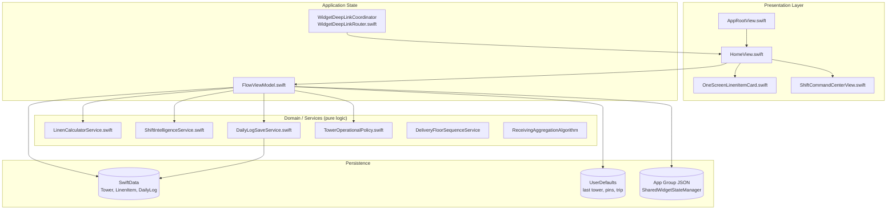
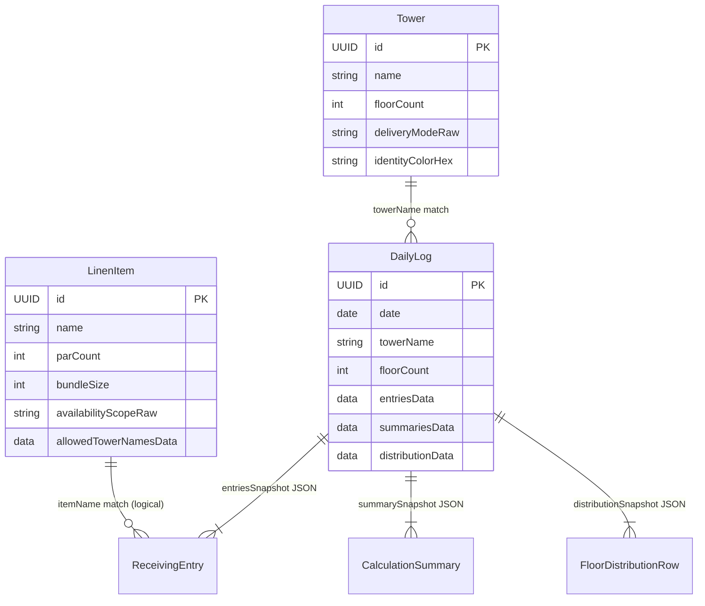
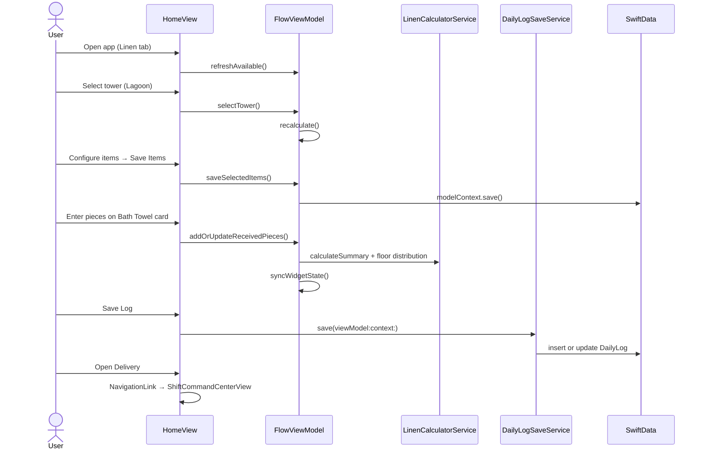
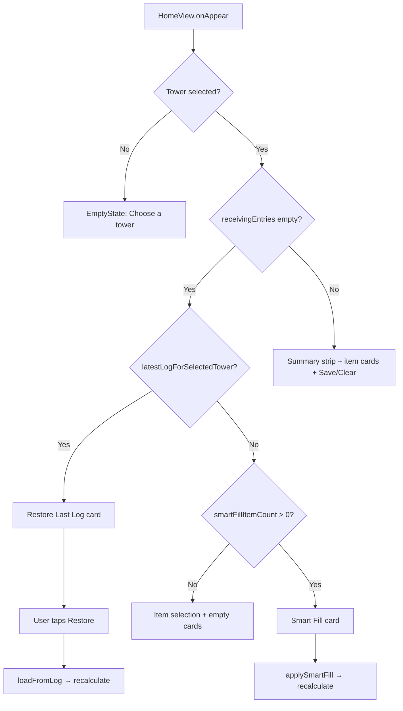

# Linen Tab — Architecture Draft (Worker: Architecture)

> **Scope:** Architecture decisions, data model, API/persistence, UI/UX flows, screen inventory, edge cases, accessibility.
> **Parent plan:** `docs/superpowers/plans/2026-06-08-linen-tab-master-plan.md`
> **Do not edit:** Main plan or other worker draft files.

---

## 1. Architectural Overview

The Linen tab is the app's primary operational surface for hotel linen attendants. It is **not** a dedicated `LinenTabView`; it is tab index 0 in `AppRootView`, labeled "Linen", with deep-link key `.home` and root view `HomeView`.

**Rationale:** Views stay thin; all calculation and validation live in testable services. `FlowViewModel` is the single source of truth for in-progress shift data. SwiftData stores durable configuration and historical logs; ephemeral session state stays in memory + UserDefaults.

---

## 2. Architecture Decisions

### AD-1: One-screen flow supersedes multi-step wizard

| | |
|---|---|
| **Decision** | Primary UX is inline entry on `HomeView` via `OneScreenLinenItemCard`; wizard screens remain registered but unused. |
| **Rationale** | Attendants work one item at a time on the floor; scrolling a card grid beats pushing 4 navigation steps. |
| **Evidence** | `HomeView` defines `FlowStep` destinations (`ReceivingView`, `ReviewReceivedView`, `ResultsView`, `FloorDistributionView`) but **never** calls `flowPath.append`. |
| **Alternatives** | **A (recommended):** Remove orphan `navigationDestination(for: FlowStep.self)` — see Phase 12 in master plan. **B:** Add "Wizard mode" toolbar entry. **C:** Move wizard views to `Views/Flow/Legacy/` and exclude from target. |
| **Files** | `LinenFlow/Views/HomeView.swift:4-10,49-61`, `LinenFlow/Views/Flow/ReceivingView.swift`, etc. |

### AD-2: In-memory receiving state + immutable log snapshots

| | |
|---|---|
| **Decision** | Active shift data (`receivingEntries`, summaries, distributions) lives in `FlowViewModel` memory. Persist only on explicit Save via `DailyLogSaveService`. |
| **Rationale** | Fast recalculation on every keystroke; logs are audit snapshots, not live editable records. |
| **Alternatives** | **Rejected:** Auto-save draft to SwiftData — adds merge complexity and stale-state bugs on app kill. **Rejected:** Core Data live objects for entries — harder to test, couples UI to persistence. |
| **Files** | `FlowViewModel.swift:67-72`, `DailyLog.swift`, `DailyLogSaveService.swift` |

### AD-3: Tower–item availability encoded on `LinenItem`, not a join table

| | |
|---|---|
| **Decision** | Per-tower item selection mutates `LinenItem.availabilityScope` + `allowedTowerNames` JSON blob. |
| **Rationale** | Matches existing Settings editor pattern; no extra `@Model` for tower–item pairs. |
| **Alternatives** | **TowerItemConfig join model** — cleaner relational model but requires migration + Settings refactor. **Per-tower UserDefaults sets** — loses sync with Settings UI. |
| **Files** | `LinenItem.swift:55-88`, `ItemAvailabilityScope.swift`, `FlowViewModel.saveSelectedItems` at `FlowViewModel.swift:286-316` |

### AD-4: Same-day log upsert (one log per tower per calendar day)

| | |
|---|---|
| **Decision** | `DailyLogSaveService.save` updates existing same-day log for tower instead of inserting duplicate. |
| **Rationale** | Attendants may save multiple times during a shift; Logs tab should show one canonical record per day. |
| **Alternatives** | **Append-only history** — better audit trail but clutters Logs UI. **Versioned logs** — overkill for v1. |
| **Files** | `DailyLogSaveService.swift:37-67`, `DailyLog.update` at `DailyLog.swift:52-65` |

### AD-5: Widget sync on every `recalculate()`

| | |
|---|---|
| **Decision** | `FlowViewModel.recalculate()` always calls `syncWidgetState()` at end. |
| **Rationale** | Home screen widget must reflect latest counts, pins, and floor progress without separate subscription layer. |
| **Alternatives** | **Debounced sync** — reduces App Group writes but risks stale widget after rapid entry. **Combine pipeline** — heavier than needed. |
| **Files** | `FlowViewModel.swift:966-1036`, `SharedWidgetStateManager.swift`, `SharedWidgetState.swift` |

### AD-6: Tower operational policy as code constants

| | |
|---|---|
| **Decision** | Known Hilton towers get locked floor counts and par-system rules via `TowerOperationalPolicy`. |
| **Rationale** | Prevents attendants from accidentally setting Lagoon to 40 floors; timeshare towers skip par caps. |
| **Alternatives** | **All floor counts editable** — caused production miscounts. **Full SwiftData policy table** — flexible but seed-heavy. |
| **Files** | `TowerOperationalPolicy.swift`, used in `HomeView.swift:622-664`, `FlowViewModel.recalculate` |

### AD-7: App-scoped `FlowViewModel` injected at boot

| | |
|---|---|
| **Decision** | Single `FlowViewModel` created in `HimmerFlowApp.init`, injected via `.environment(flowViewModel)`. |
| **Rationale** | Linen tab, widgets, and delivery command center share one session; tower/entries survive tab switches. |
| **Alternatives** | **Per-tab ViewModel** — breaks widget pin + delivery continuity. **@Query-driven state** — wrong tool for ephemeral entries. |
| **Files** | `HimmerFlowApp.swift:71-77,115`, `AppRootView.swift:5` |

---

## 3. Data Model

### 3.1 SwiftData entities (`@Model`)

| Entity | File | Purpose | Key fields |
|--------|------|---------|------------|
| `Tower` | `Models/Tower.swift` | Property towers | `name`, `floorCount`, `deliveryModeRaw`, `identityColorHex`, `startFloor`/`topFloor`, geo calibration |
| `LinenItem` | `Models/LinenItem.swift` | Catalog + par config | `name`, `parCount`, `countMethodRaw`, `bundleSize`, `allowedTowerNamesData`, `availabilityScopeRaw` |
| `DailyLog` | `Models/DailyLog.swift` | Immutable shift snapshot | JSON blobs: `entriesData`, `summariesData`, `distributionData` |

Schema registration and migration: `HimmerFlowApp.swift:46-54`, `HimmerFlowMigrationPlan.swift` (V1: Tower/LinenItem/DailyLog → V2 adds shift models).

Seed data: `SeedService.swift`, `SeedData/DefaultData.swift`.

### 3.2 Value types (Codable, in-memory + log snapshots)

| Type | File | Role |
|------|------|------|
| `ReceivingEntry` | `Models/ReceivingEntry.swift` | One received line (pieces, bins, method) |
| `CalculationSummary` | `Models/CalculationSummary.swift` | Par/overage/shortage summary per item |
| `FloorDistributionRow` | `Models/FloorDistributionRow.swift` | Per-floor piece/bundle allocation |
| `CountMethod` | `Models/CountMethod.swift` | `.fixedBin`, `.manualPieces`, `.cartLabelPieces` |
| `CalculationStatus` | `Models/CalculationStatus.swift` | `.exact`, `.overage`, `.shortage` |
| `ItemSupplyPrediction` | `Models/ShiftIntelligenceModels.swift` | Smart fill prediction |
| `SharedWidgetState` | `Models/SharedWidgetState.swift` | Widget/Live Activity payload |

### 3.3 Display grouping (computed, not persisted)

| Enum | File | Used by |
|------|------|---------|
| `TowerDisplayGroup` | `Tower.swift:9-40` | Tower picker sections (piece vs bundle towers) |
| `LinenItemDisplayGroup` | `LinenItem.swift:4-40` | Item card sections (bath/bedding/specialty) |

### 3.4 Entity relationship diagram

**Note:** No foreign keys — `DailyLog.towerName` and entry `itemName` are denormalized strings for snapshot stability if catalog changes later.

---

## 4. API / Persistence Layer

### 4.1 FlowViewModel public API (Linen tab contract)

| Method / property | Purpose | Triggers |
|-------------------|---------|----------|
| `selectTower(_:)` | Set tower, reset trip on change | Tower picker |
| `updateSelectedTowerFloorCount(_:)` | Persist floor count (unless protected) | Stepper in picker |
| `saveSelectedItems(_:for:)` | Persist item availability | Item selection card Save |
| `addOrUpdateReceivedPieces(item:pieces:)` | Primary one-screen entry | `OneScreenLinenItemCard` |
| `recalculate()` | Rebuild summaries + distributions + widget | After any entry change |
| `clearEntries()` | Reset entries, notes, delivery session | Clear confirmation |
| `loadFromLog(_:)` | Restore from snapshot | Restore Last Log card |
| `applySmartFill()` | Fill from predictions | Smart Fill card |
| `updateShiftIntelligence(from:)` | Refresh predictions | `@Query` logs change |
| `buildDailyLog()` | Construct snapshot | `DailyLogSaveService` |
| `syncWidgetState(...)` | Write App Group + reload widget | `recalculate`, pin toggle, delivery |
| `toggleWidgetPin(for:)` | Pin/unpin (max 3) | Card widget pill |

Source: `LinenFlow/ViewModels/FlowViewModel.swift`.

### 4.2 Service APIs

**LinenCalculatorService** (`Services/LinenCalculatorService.swift`) — pure functions:
- `calculateSummary` / `calculateNoParSummary` — par vs timeshare towers
- `calculateFloorDistribution` — piece spread across floors
- `calculateCappedBundleFloorDistribution` — bundle delivery with par cap
- `convertPiecesToBundles` — bundle math

**ShiftIntelligenceService** (`Services/ShiftIntelligenceService.swift`):
- `predictions(towerName:items:logs:)` — median from historical logs, weekday-aware
- `anomalies(entries:predictions:)` — deviation >25% from typical

**DailyLogSaveService** (`Services/DailyLogSaveService.swift`):
- `save(viewModel:context:) -> Result<DailyLog, SaveLogError>` — validates tower, entries, summaries; upserts same-day log

### 4.3 Persistence stores

| Store | Keys / entities | Written by | Read by |
|-------|-----------------|------------|---------|
| SwiftData | `Tower`, `LinenItem`, `DailyLog` | Seed, Settings, Save, item/tower edits | `@Query` in HomeView, FlowViewModel fetch |
| UserDefaults (standard) | `himmerflow.lastSelectedTowerID`, `himmerflow.pinnedWidgetItemNames`, `himmerflow.currentTripItemNames`, per-card `linen.card.background.{uuid}` | FlowViewModel, OneScreenLinenItemCard | FlowViewModel init, card onAppear |
| App Group `group.com.himmerflow.shared` | `himmerflow.widgetState` | `SharedWidgetStateManager.save` | Widget extension, delivery rehydration |
| Legacy migration | `linenflow.*` → `himmerflow.*` | `FlowViewModel.migrateLegacyUserDefaultsKeys`, `SharedWidgetStateManager` | Boot |

### 4.4 Deep link API

URLs: `linenflow://widget/start`, `himmerflow://widget/delivery?tower=Lagoon`

Handler: `WidgetDeepLinkCoordinator.handle(_:flowViewModel:)` in `Utilities/WidgetDeepLinkRouter.swift`:
- `.start` → select Linen tab
- `.delivery(towerName:)` → select tower, Linen tab, push `ShiftCommandCenterView`

Consumed in `HomeView.swift:87-91`.

---

## 5. UI/UX Flows

### 5.1 Primary happy path

### 5.2 Cold start with intelligence

Sources: `HomeView.swift:67-72,106-109,157-193,196-237`.

### 5.3 Inline item editing (focus model)

1. User taps expression field on a card → `activateEditing(item)` sets `focusedItemID`
2. Other cards dim (`opacity 0.42`, `allowsHitTesting false`) — `HomeView.itemCard`
3. Keyboard toolbar: Previous / Next / Done — `KeyboardEditingToolbar` via `itemEditingKeyboardBar`
4. Done on fresh entry auto-advances to next unfilled item — `handleEditingDone()`
5. `EquatableLinenListCard` minimizes re-renders during focus churn

Files: `HomeView.swift:883-1034`, `Views/Components/KeyboardPinnedEditorShell.swift`.

### 5.4 Delivery handoff

Two entry points (same destination):
- Bottom chrome `NavigationLink` → `ShiftCommandCenterView` (`HomeView.swift:240-275,875-880`)
- Widget deep link → `showDeliveryCommandCenter = true` (`HomeView.swift:63-65,87-91`)

`FlowViewModel` owns `deliverySessionState`; tower change while active resets session (`FlowViewModel.swift:168-170`).

---

## 6. Screen Inventory

### 6.1 Linen tab — active surfaces

| Surface | File | Role |
|---------|------|------|
| Tab shell | `Views/AppRootView.swift:11-15` | Tab 0 "Linen" |
| Root | `Views/HomeView.swift` | NavigationStack, all primary sections |
| Tower picker | `HomeView.towerPicker` + `TowerPickerEnvironmentView` | Inline tower + map preview |
| Smart Fill | `SmartFillCard` in `Views/Components/IntelligenceCards.swift` | Predictions |
| Restore log | `HomeView.useLastLogCard` | Load previous snapshot |
| Item config | `HomeView.itemSelectionCard` | Toggle active items per tower |
| Item entry | `Views/Flow/OneScreenLinenItemCard.swift` | Expression input, distribution, trip/widget pills |
| Summary | `HomeView.summaryStrip` | Totals strip |
| Actions | `HomeView.inlineActions` | Save Log, Clear |
| Notes | `HomeView.notesField` | Optional shift note |
| Delivery CTA | `HomeView.bottomChrome` | Open Delivery |

### 6.2 Linen tab — registered but dormant (wizard orphan)

| Screen | File | FlowStep |
|--------|------|----------|
| Receiving | `Views/Flow/ReceivingView.swift` | `.receiving` |
| Review | `Views/Flow/ReviewReceivedView.swift` | `.review` |
| Results | `Views/Flow/ResultsView.swift` | `.results` |
| Floor plan | `Views/Flow/FloorDistributionView.swift` | `.floorPlan` |
| Rebalance | `Views/Flow/RebalanceShortFloorsView.swift` | `.rebalance(itemName:)` |

**Status:** Registered in `HomeView.navigationDestination` but no navigation push in production path. Decision required (Phase 12).

### 6.3 Adjacent surfaces (reachable from Linen tab)

| Screen | File | Entry |
|--------|------|-------|
| Delivery Command | `Views/Flow/ShiftCommandCenterView.swift` | Bottom chrome / deep link |
| Floor checklist | `Views/Flow/FloorChecklistView.swift` | From command center |
| Rebalance | `Views/Flow/RebalanceShortFloorsView.swift` | Could be pushed (orphan route only today) |

### 6.4 Not Linen tab but consumes same data

| Tab | View | Shared state |
|-----|------|--------------|
| Logs | `Views/Tabs/LogsTabView.swift` → `LogsView` | Reads `DailyLog` snapshots |
| Settings | `Views/Tabs/SettingsTabView.swift` → `SettingsView` | Edits `Tower`, `LinenItem` |
| Insights | `Views/Insights/InsightsView.swift` | Historical analytics |
| Widget | `LinenFlow Widget/LinenFlow_Widget.swift` | `SharedWidgetState` |

---

## 7. Edge Cases & Failure Modes

| Scenario | Behavior | Source |
|----------|----------|--------|
| No tower selected | Empty state; Save disabled; widget cleared | `recalculate()` guard, `SaveLogError.noTower` |
| Tower deactivated while selected | Auto-deselect on `refreshAvailable()` | `FlowViewModel.swift:158-163` |
| Tower change during active delivery | Session reset + warning log | `FlowViewModel.selectTower` |
| Protected floor count (Lagoon, etc.) | Stepper disabled; locked count from policy | `TowerOperationalPolicy.confirmedDeliveryFloorCount`, `HomeView` stepper |
| Timeshare tower (Lagoon/GI/GW) | No par system; `calculateNoParSummary` | `TowerOperationalPolicy.usesParSystem` |
| Bundle mode + loose pieces | Validation warning; loose not delivered as bundles | `validateInputs()` |
| Zero pieces entered | Entry removed; card clears | `addOrUpdateReceivedPieces` guard |
| Save with empty entries | `SaveLogError.noEntries`; button disabled in UI | `HomeView.inlineActions` |
| Save with missing summaries | `SaveLogError.invalidCalculations` | `DailyLogSaveService` |
| Same-day re-save | Updates existing log, not duplicate | `DailyLogSaveService` predicate |
| Restore log with renamed/deleted items | Filters to `availableItemNames` | `loadFromLog` |
| Smart fill with bin-count items | Uses `predictedBins` + `addOrUpdateReceivingEntry` | `applySmartFill()` |
| Anomaly detection | Shown in `WarningCard` + card indicator | `supplyAnomalies` |
| Double Sheet on non-Diamond tower | Warning only (not blocking) | `validateInputs()` |
| Custom property mode | Tower map hidden (`isCustomProperty` AppStorage) | `HomeView.showsTowerEnvironmentMap` |
| Widget pin limit | Max 3 items | `toggleWidgetPin` |
| Legacy LinenFlow keys | Migrated at boot | `migrateLegacyUserDefaultsKeys` |
| SwiftData save failure (floor count) | `saveError` string set | `updateSelectedTowerFloorCount` |
| Item save failure | Banner "Could not save tower items." | `HomeView.saveSelectedTowerItems` |

---

## 8. Accessibility

### 8.1 Current strengths

| Area | Implementation | File |
|------|----------------|------|
| Focused card lock | Custom `accessibilityLabel` for focused/locked cards | `HomeView.linenCardAccessibilityLabel` |
| Open Delivery | Label + hint when disabled | `HomeView.shiftCommanderStartButton` |
| Restore log | `accessibilityLabel("Load last … log")` | `HomeView.useLastLogCard` |
| Trip / widget pills | Toggle labels and hints | `OneScreenLinenItemCard.swift:339-363` |
| Supply anomaly | `accessibilityLabel(anomaly.message)` | `OneScreenLinenItemCard.swift:312` |
| PremiumCard selection trait | `accessibilityAddTraits(.isSelected)` when `isCurrent` | `PremiumCard.swift:53` |

### 8.2 Gaps (Phase 11 priorities)

| Gap | Impact | Recommended fix |
|-----|--------|-----------------|
| `PremiumCard.isCurrent` not passed from `OneScreenLinenItemCard` | Duplicate focus styling; VoiceOver misses card-level selected trait | Pass `isCurrent: isFocused` from parent; remove duplicate stroke overlay in `HomeView.itemCard` |
| Distribution expand/collapse | Silent control for VoiceOver | Add label: "Floor distribution, expanded/collapsed" + hint |
| Expression commit | Parsed total not announced | Post `AccessibilityNotification.announcement` on commit |
| Floor rows | Dense visual only | Label: "{N} pieces to floors {range}" |
| Reduce Motion | Card scale animations always run | Gate `.animation` on `@Environment(\.accessibilityReduceMotion)` |
| Dynamic Type XXXL | Card header may clip | Already uses `ViewThatFits` in places; audit `OneScreenLinenItemCard` header grids |

### 8.3 Accessibility test checklist

1. VoiceOver: tower picker → select tower → hear floor count
2. Focus first item card → hear "current editing item"
3. Enter expression → hear updated piece count after Done
4. Expand distribution → hear floor breakdown
5. Toggle trip pill → hear add/remove state
6. Save Log → confirmation banner readable
7. Open Delivery → navigate to command center with logical focus order

---

## 9. Cross-Reference Index

| Concern | Primary files |
|---------|---------------|
| Tab registration | `Views/AppRootView.swift` |
| Linen root UI | `Views/HomeView.swift` |
| State / orchestration | `ViewModels/FlowViewModel.swift` |
| Calculation | `Services/LinenCalculatorService.swift`, `Core/TimelineComputation.swift` (shift tab only) |
| Intelligence | `Services/ShiftIntelligenceService.swift` |
| Log persistence | `Services/DailyLogSaveService.swift`, `Models/DailyLog.swift` |
| Models | `Models/Tower.swift`, `Models/LinenItem.swift`, `Models/ReceivingEntry.swift` |
| Widget bridge | `Services/SharedWidgetStateManager.swift`, `Utilities/WidgetDeepLinkRouter.swift` |
| Boot / DI | `App/HimmerFlowApp.swift` |
| Tests | `LinenFlowTests/FlowViewModelTests.swift`, `DailyLogSaveTests.swift`, `CalculatorTests.swift` |

---

*Architecture draft — 2026-06-08. Aligns with master plan on branch `cursor/linen-tab-master-plan-32f4`.*