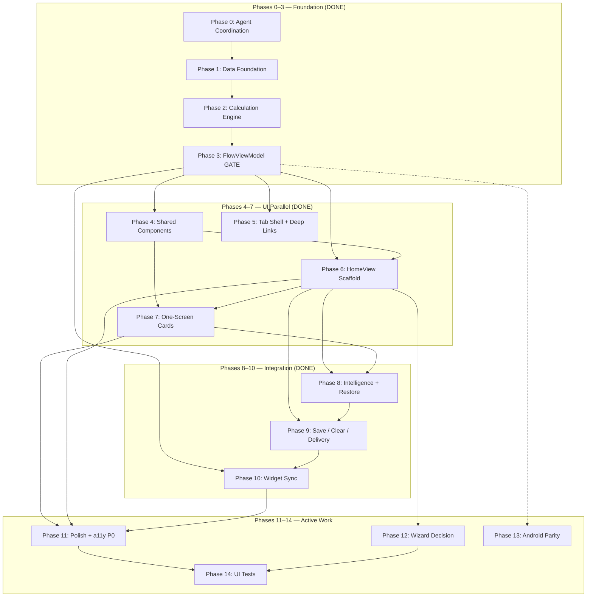
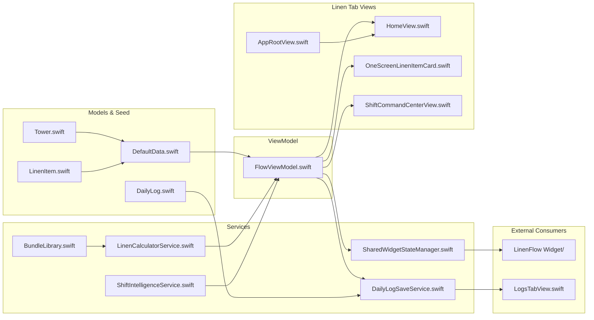
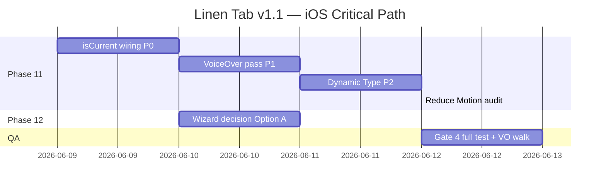

# Linen Tab Master Plan — Phases, Goals & Timeline (Draft)

> **Worker scope:** Goals, success criteria, non-goals, phased breakdown, dependencies, actionable tasks, effort estimates, timeline.
>
> **Companion to:** `docs/superpowers/plans/2026-06-08-linen-tab-master-plan.md` (do not edit main plan from this draft).
>
> **Codebase snapshot:** 2026-06-08 — 283 unit tests passing, Linen tab core workflow complete in `HomeView.swift`. Active work concentrates on Phases 11–14.

---

## Goals

### Primary goal

Deliver and maintain the **Linen tab** as the hotel attendant's primary operational surface: select a tower, configure active linen items, enter received inventory with safe arithmetic, see inline bundle math and per-floor distribution, persist immutable daily logs, and hand off to live delivery guidance — all without leaving the one-screen card grid.

### Supporting goals

| # | Goal | Primary code anchor |
|---|------|---------------------|
| G1 | **Single-screen dominance** — one-screen cards (`OneScreenLinenItemCard`) are the default path; multi-step wizard is optional or removed | `LinenFlow/Views/HomeView.swift`, `LinenFlow/Views/Flow/OneScreenLinenItemCard.swift` |
| G2 | **Calculation integrity** — all bundle/floor math lives in services, never in views | `LinenFlow/Services/LinenCalculatorService.swift`, `LinenFlow/Services/BundleLibrary.swift` |
| G3 | **Immutable audit trail** — daily logs store encoded snapshots, not live model references | `LinenFlow/Models/DailyLog.swift`, `LinenFlow/Services/DailyLogSaveService.swift` |
| G4 | **Shift intelligence** — Smart Fill and Restore Last Log reduce repetitive data entry | `LinenFlow/Services/ShiftIntelligenceService.swift`, `HomeView` `smartFillCard` / `useLastLogCard` |
| G5 | **Delivery handoff** — Linen tab opens `ShiftCommandCenterView` for pace, trips, and floor completion | `HomeView` `shiftCommanderStartButton`, `LinenFlow/Views/Flow/ShiftCommandCenterView.swift` |
| G6 | **Widget continuity** — App Group sync keeps home-screen widget and Live Activity aligned with Linen tab state | `LinenFlow/Services/SharedWidgetStateManager.swift`, `FlowViewModel.syncWidgetState` |
| G7 | **Deep-link landing** — widget URLs open Linen tab and optionally push delivery command center | `LinenFlow/Utilities/WidgetDeepLinkRouter.swift`, `AppRootView.swift` |
| G8 | **Parallel-safe maintenance** — agents coordinate via `AGENT_WORK_LOG.md`; high-conflict files serialized | `AGENT_WORK_LOG.md` (repo root) |

### Outcome statement

An attendant on a 21-floor tower can: pick Lagoon → save 6 active items → Smart Fill or enter pieces on cards → see distribution rows update → Save Log → Open Delivery — in under 3 minutes, with VoiceOver and Dynamic Type support, and 283+ unit tests green.

---

## Success Criteria

Criteria are **measurable** and map to verification commands or manual checks. Status reflects codebase as of 2026-06-08.

| ID | Criterion | Status | Verification |
|----|-----------|--------|--------------|
| SC-01 | Linen tab is tab index 0 with `shippingbox.fill` label | ✅ Done | `AppRootView.swift` lines 11–15 |
| SC-02 | Tower selection is inline (no `TowerSelectionView` route) | ✅ Done | `HomeView` `towerPicker` collapsed/expanded states |
| SC-03 | Per-tower item checklist persists to SwiftData | ✅ Done | `saveSelectedTowerItems()` → `FlowViewModel.saveSelectedItems` |
| SC-04 | Arithmetic expression entry evaluates safely | ✅ Done | `PremiumExpressionInput` → `ArithmeticParser` (26 tests) |
| SC-05 | Inline summary + floor distribution on each entry | ✅ Done | `FlowViewModel.recalculate()` → `deliveryFloorDistributions` |
| SC-06 | Smart Fill and Restore Last Log when entries empty | ✅ Done | `HomeView` `smartFillCard`, `useLastLogCard` |
| SC-07 | Save Log writes immutable snapshot | ✅ Done | `DailyLogSaveService` + `DailyLogSaveTests` (11 cases) |
| SC-08 | Clear Entries with confirmation dialog | ✅ Done | `HomeView` `showClearConfirmation` → `clearEntries()` |
| SC-09 | Open Delivery navigates to command center | ✅ Done | `bottomChrome` `NavigationLink` + deep-link `showDeliveryCommandCenter` |
| SC-10 | Widget deep links land on Linen tab | ✅ Done | `WidgetDeepLinkCoordinator.handle` routes `.home` |
| SC-11 | Unit test suite ≥ 283 cases pass | ✅ Done | `xcodebuild test` (see Verification Gates) |
| SC-12 | Focused card uses `PremiumCard.isCurrent` (no duplicate stroke) | ⬜ **Gap** | `PremiumCard.swift` has API; `OneScreenLinenItemCard` does not pass `isCurrent`; `HomeView` lines 905–908 add duplicate overlay |
| SC-13 | VoiceOver covers distribution, expression input, trip pills | 🟡 Partial | `HomeView` card labels done (2026-06-07); `OneScreenLinenItemCard` distribution/input gaps remain per `AGENT_WORK_LOG.md` |
| SC-14 | Dynamic Type XXXL on card grid without clipping | ⬜ **Gap** | Manual audit on `OneScreenLinenItemCard` + `slimSummaryContent` |
| SC-15 | Wizard flow decision documented and implemented | ⬜ **Open** | `HomeView` registers `FlowStep` destinations but never `flowPath.append` from root |
| SC-16 | Android Linen screen parity (smart fill, inline distribution) | 🟡 Partial | `android/app/src/main/java/com/himmerflow/android/` — basics done, gaps listed in Phase 13 |
| SC-17 | XCUITest happy-path coverage | ⬜ **Gap** | No `LinenFlowUITests` target (noted in `Docs/FinalReport.md`) |

**Definition of done (Linen tab v1.1):** SC-01 through SC-11 ✅ (already met) **plus** SC-12, SC-13, SC-14, SC-15 resolved. SC-16 and SC-17 are stretch goals for v1.2.

---

## Non-Goals

Explicitly **out of scope** for this master plan to prevent scope creep:

| # | Non-goal | Rationale |
|---|----------|-----------|
| NG-01 | **Shift tab redesign** | Owned by Shift/HimmerFlow migration plan; Linen tab only hands off via Open Delivery |
| NG-02 | **Insights tab analytics** | `InsightsView` + `DailyReportService` are separate; Linen tab only produces log data they consume |
| NG-03 | **Settings / tower calibration UX** | `SettingsView`, `TowerCalibrationView` — attendants configure towers elsewhere |
| NG-04 | **LogFilterBuilder implementation** | Test stub only (`LinenFlowTests/LogFilterBuilderTests.swift`); Logs tab filtering is a separate feature |
| NG-05 | **TowerConfigService implementation** | Test stub only (`LinenFlowTests/TowerConfigServiceTests.swift`); tower CRUD beyond floor count stepper is Settings scope |
| NG-06 | **Re-homing legacy Shift delivery UI** | `ShiftTabView+LegacyDeliveryContent.swift` is archived reference, not Linen tab wiring |
| NG-07 | **Changing protected bundle constants** | `BundleLibrary.swift` constants are invariant per `Docs/CriteriaChecklist.md` |
| NG-08 | **SwiftData schema migration for DailyLog** | Snapshots are version-tolerant Codable blobs; no migration work unless model shape breaks decode |
| NG-09 | **New linen item types or tower seed data** | `DefaultData.swift` 5 towers / 11 items are fixed unless product explicitly requests |
| NG-10 | **Backend / cloud sync** | Local-first SwiftData + App Group only |
| NG-11 | **Renaming app from HimmerFlow branding** | Cosmetic; does not block Linen tab function |

---

## Phased Breakdown Overview

Phases 0–10 describe the **canonical build sequence** (retrospective — already shipped). Phases 11–14 are **active work**. Each phase lists entry criteria, exit criteria, and owner track from the main plan.



### Phase status summary

| Phase | Name | Track | Status | Effort (remaining) |
|-------|------|-------|--------|-------------------|
| 0 | Agent Coordination Setup | — | ✅ Done | 0 h |
| 1 | Data Foundation | A | ✅ Done | 0 h |
| 2 | Calculation Engine | A | ✅ Done | 0 h |
| 3 | FlowViewModel (gate) | A | ✅ Done | 0 h |
| 4 | Shared UI Components | B | ✅ Done | 0 h |
| 5 | Tab Shell & Deep Links | C | ✅ Done | 0 h |
| 6 | HomeView Scaffold | D | ✅ Done | 0 h |
| 7 | One-Screen Linen Cards | E | ✅ Done | 0 h |
| 8 | Intelligence & Restore | F | ✅ Done | 0 h |
| 9 | Save, Clear, Delivery | G | ✅ Done | 0 h |
| 10 | Widget Sync | H | ✅ Done | 0 h |
| 11 | Polish & Accessibility | I | 🟡 In progress | **8–12 h** |
| 12 | Wizard Flow Decision | J | ⬜ Not started | **2–4 h** |
| 13 | Android Parity | K | 🟡 Partial | **16–24 h** |
| 14 | UI Tests | L | ⬜ Not started | **8–12 h** |

**Total remaining (iOS critical path):** ~18–28 hours (Phases 11–12 + Gate 4 QA).
**Total remaining (full plan incl. Android + UI tests):** ~34–52 hours.

---

## Dependency Graph (Detailed)



### Hard dependencies (must complete before downstream)

| Blocker | Blocks | Reason |
|---------|--------|--------|
| Phase 3 `FlowViewModel` | Phases 4–10 | All UI reads/writes through `@Environment(FlowViewModel.self)` |
| Phase 4 `PremiumCard` + `PremiumExpressionInput` | Phases 6–7 | Cards and HomeView depend on component APIs |
| Phase 6 `HomeView` scaffold | Phases 8–9, 11–12 | Intelligence cards and bottom chrome are HomeView sections |
| Phase 7 `OneScreenLinenItemCard` | Phase 11 | Polish targets card focus and distribution a11y |
| Phase 9 `DailyLogSaveService` | Logs tab verification | Save Log is Linen → Logs handoff |
| Phase 11 SC-12 (`isCurrent` wiring) | Phase 14 UI tests | Tests should assert single focus indicator |

### Soft dependencies (can parallelize with coordination)

| Track A | Track B | Coordination rule |
|---------|---------|-------------------|
| D (HomeView) | E (OneScreenLinenItemCard) | Different files; D only touches `EquatableLinenListCard` wrapper |
| G (Save/Clear) | H (Widget Sync) | Both touch `FlowViewModel` — serialize via `AGENT_WORK_LOG.md` |
| I (HomeView a11y) | I (Card a11y) | Agent 1 owns `HomeView.swift`; Agent 2 owns `OneScreenLinenItemCard.swift` only |
| J (Wizard) | K (Android) | Fully independent codebases |

---

## Detailed Actionable Tasks by Phase

### Phase 0 — Agent Coordination Setup ✅

**Entry:** Any multi-agent session on Linen tab.
**Exit:** `AGENT_WORK_LOG.md` exists with Active Claims table.

| Task | Action | File(s) | Est. |
|------|--------|---------|------|
| 0.1 | Verify coordination file exists | `AGENT_WORK_LOG.md` | 5 min |
| 0.2 | Claim files before edit (add Active Claims row) | `AGENT_WORK_LOG.md` | 2 min |
| 0.3 | On completion, move row to Completed Work with build result | `AGENT_WORK_LOG.md` | 5 min |

**Conflict hotspots:** `HomeView.swift` (~1,135 lines), `FlowViewModel.swift` (~1,634 lines) — one agent each.

---

### Phase 1 — Data Foundation ✅

**Entry:** Empty SwiftData container.
**Exit:** Build succeeds; towers and items seed on launch.

| Task | Action | File(s) | Est. |
|------|--------|---------|------|
| 1.1 | `@Model Tower` — name, floorCount, identityColorHex, sortOrder | `LinenFlow/Models/Tower.swift` | 30 min |
| 1.2 | `@Model LinenItem` — bundleSize, countMethod, allowedTowerNames JSON | `LinenFlow/Models/LinenItem.swift` | 30 min |
| 1.3 | Codable structs for transient flow state | `ReceivingEntry`, `CalculationSummary`, `FloorDistributionRow` | 45 min |
| 1.4 | `@Model DailyLog` with encoded snapshot `Data` fields | `LinenFlow/Models/DailyLog.swift` | 30 min |
| 1.5 | Seed 5 towers + 11 items with locked bundle sizes | `LinenFlow/SeedData/DefaultData.swift` | 45 min |
| 1.6 | Idempotent `seedIfNeeded` + `ModelContainer` wiring | `SeedService.swift`, `HimmerFlowApp.swift` | 30 min |

**Verify:**
```bash
xcodebuild -project LinenFlow.xcodeproj -scheme HimmerFlow \
  -destination 'platform=iOS Simulator,name=iPhone Air' build
```

---

### Phase 2 — Calculation Engine ✅

**Entry:** Phase 1 models exist.
**Exit:** 45+ arithmetic/calculator tests pass; no SwiftUI in Services.

| Task | Action | File(s) | Est. |
|------|--------|---------|------|
| 2.1 | Safe arithmetic parser (no eval injection) | `LinenFlow/Utilities/ArithmeticParser.swift` | 1 h |
| 2.2 | 26 arithmetic tests | `LinenFlowTests/ArithmeticTests.swift` | 1 h |
| 2.3 | Protected bundle constants + aliases | `LinenFlow/Services/BundleLibrary.swift` | 45 min |
| 2.4 | `calculateSummary` + `distributeAcrossFloors` pure functions | `LinenFlow/Services/LinenCalculatorService.swift` | 2 h |
| 2.5 | Floor range label formatting | `LinenFlow/Services/FloorRangeBuilder.swift` | 30 min |
| 2.6 | 19+ calculator tests pinning formulas | `LinenFlowTests/CalculatorTests.swift` | 1.5 h |

---

### Phase 3 — FlowViewModel (GATE) ✅

**Entry:** Phase 2 services complete.
**Exit:** 58 `FlowViewModelTests` pass; injected via `HimmerFlowApp`.

| Task | Action | File(s) | Est. |
|------|--------|---------|------|
| 3.1 | Core `@Observable` state: tower, entries, summaries, distributions | `LinenFlow/ViewModels/FlowViewModel.swift` | 2 h |
| 3.2 | `selectTower`, `addOrUpdateReceivedPieces`, `recalculate` | same | 1.5 h |
| 3.3 | `saveSelectedItems`, `clearEntries`, `loadFromLog`, `applySmartFill` | same | 1.5 h |
| 3.4 | `deliverySessionState`, widget item pinning, `syncWidgetState` stub | same | 1 h |
| 3.5 | 58 view-model tests | `LinenFlowTests/FlowViewModelTests.swift` | 3 h |
| 3.6 | `.environment(flowViewModel)` injection | `LinenFlow/App/HimmerFlowApp.swift` | 15 min |

**Gate 1 verify:** Full unit test suite for Tracks A.

---

### Phase 4 — Shared UI Components ✅

**Entry:** Phase 1 models (for previews).
**Exit:** Components build; `PremiumCard.isCurrent` API available.

| Task | Action | File(s) | Est. |
|------|--------|---------|------|
| 4.1 | `PremiumCard` styles + `isCurrent` glow/scale/trait | `LinenFlow/Views/Components/PremiumCard.swift` | 2 h |
| 4.2 | `PremiumExpressionInput` with haptics + parse errors | `LinenFlow/Views/Components/PremiumExpressionInput.swift` | 1.5 h |
| 4.3 | `AppBackground`, `EmptyStateView`, `WarningCard` | `Views/Components/` | 1 h |
| 4.4 | `SmartFillCard`, `KeyboardEditingToolbar` | `IntelligenceCards.swift`, `KeyboardPinnedEditorShell.swift` | 1 h |
| 4.5 | `LinenItemIcon`, `TowerPickerEnvironmentView` | `Views/Components/` | 1 h |

---

### Phase 5 — Tab Shell & Deep Links ✅

**Entry:** Phase 3 `FlowViewModel` injectable.
**Exit:** Widget URL opens Linen tab.

| Task | Action | File(s) | Est. |
|------|--------|---------|------|
| 5.1 | Register Linen tab as `.home` tag 0 | `LinenFlow/Views/AppRootView.swift` | 30 min |
| 5.2 | `WidgetDeepLinkCoordinator` — parse `linenflow://widget/start` and `/delivery` | `LinenFlow/Utilities/WidgetDeepLinkRouter.swift` | 45 min |
| 5.3 | `.onOpenURL` + `consumeDeliveryCommandCenterRequest` | `AppRootView.swift`, `HomeView.swift` | 30 min |

---

### Phase 6 — HomeView Scaffold ✅

**Entry:** Phases 3–5 complete.
**Exit:** Tower pick + item selection work; empty state shows.

| Task | Action | File(s) | Est. |
|------|--------|---------|------|
| 6.1 | `NavigationStack`, `AppBackground`, keyboard toolbar | `LinenFlow/Views/HomeView.swift` | 1 h |
| 6.2 | Header with date + live indicator | same | 30 min |
| 6.3 | Collapsed/expanded tower picker + map (`TowerPickerEnvironmentView`) | same | 2 h |
| 6.4 | Floor count stepper with `TowerOperationalPolicy` locks | same + policy tests | 45 min |
| 6.5 | Item selection card with draft `Set<UUID>` + Save | same | 1 h |
| 6.6 | `navigationDestination` for `FlowStep` + delivery push | same | 30 min |

---

### Phase 7 — One-Screen Linen Cards ✅

**Entry:** Phase 6 scaffold + Phase 4 components.
**Exit:** Entering pieces updates summary and distribution inline.

| Task | Action | File(s) | Est. |
|------|--------|---------|------|
| 7.1 | Card sections: header, expression, summary, distribution, trip pills | `LinenFlow/Views/Flow/OneScreenLinenItemCard.swift` | 3 h |
| 7.2 | `LinenCardBackground` per-item `@AppStorage` | same | 30 min |
| 7.3 | `EquatableLinenListCard` wrapper for perf | `HomeView.swift` (private struct) | 1 h |
| 7.4 | Focus management: `focusedItemID`, keyboard next/prev | `HomeView.swift` | 1.5 h |
| 7.5 | Wire `itemList` grouped by `itemDisplayGroups` | `HomeView.swift` | 45 min |

**Gate 2 verify:** Manual Lagoon → Bath Towel 100 → 20 bundles + 21-floor distribution.

---

### Phase 8 — Intelligence & Restore ✅

**Entry:** Phase 6 HomeView sections exist.
**Exit:** Smart Fill / Restore appear when entries empty and logs exist.

| Task | Action | File(s) | Est. |
|------|--------|---------|------|
| 8.1 | `useLastLogCard` — query `@Query` logs, filter by tower | `HomeView.swift` | 45 min |
| 8.2 | `smartFillCard` — confidence from `supplyPredictions` | `HomeView.swift` + `ShiftIntelligenceService.swift` | 1 h |
| 8.3 | `refreshShiftIntelligence()` on appear / tower / log change | `HomeView.swift` | 30 min |

---

### Phase 9 — Save, Clear, Delivery ✅

**Entry:** Phase 7 entries calculable.
**Exit:** Save appears in Logs tab; Open Delivery works.

| Task | Action | File(s) | Est. |
|------|--------|---------|------|
| 9.1 | Inline Save / Clear with confirmation | `HomeView.swift` `inlineActions` | 45 min |
| 9.2 | Notes field bound to `viewModel.notes` | `HomeView.swift` `notesField` | 15 min |
| 9.3 | Summary strip (items, pcs, bdl, loose) | `HomeView.swift` `slimSummaryContent` | 30 min |
| 9.4 | Bottom chrome Open Delivery `NavigationLink` | `HomeView.swift` `shiftCommanderStartButton` | 30 min |
| 9.5 | `DailyLogSaveService.save` + 11 tests | `DailyLogSaveService.swift`, `DailyLogSaveTests.swift` | 1.5 h |

**Gate 3 verify:** Save → Logs tab → Clear → Open Delivery.

---

### Phase 10 — Widget Sync ✅

**Entry:** Phase 9 delivery handoff exists.
**Exit:** Widget reflects pinned items and tower.

| Task | Action | File(s) | Est. |
|------|--------|---------|------|
| 10.1 | `syncWidgetState()` after recalculate, tower change, trip toggle | `FlowViewModel.swift` | 1 h |
| 10.2 | App Group write `group.com.himmerflow.shared` | `SharedWidgetStateManager.swift` | 45 min |
| 10.3 | Trip/widget pills on card | `OneScreenLinenItemCard.swift` | 45 min |

---

### Phase 11 — Polish & Accessibility 🟡 ACTIVE

**Entry:** Phases 7–10 complete.
**Exit:** SC-12, SC-13, SC-14 met; Gate 4 manual VoiceOver pass.

**Priority:** P0 → P1 → P2.

#### Task 11.1 — Wire `PremiumCard.isCurrent` (P0) ⬜

| Step | Action | File(s) | Est. |
|------|--------|---------|------|
| 11.1.1 | Add `isFocused: Bool` prop to `OneScreenLinenItemCard` (or reuse existing focus callbacks) | `OneScreenLinenItemCard.swift` | 15 min |
| 11.1.2 | Pass `isCurrent: isFocused` into root `PremiumCard` | same | 10 min |
| 11.1.3 | Remove duplicate stroke overlay in `HomeView.itemCard` (lines 905–908) | `HomeView.swift` | 10 min |
| 11.1.4 | Pass `isCurrent: true` on `KeyboardEditingPlaceholder` if used | `KeyboardPinnedEditorShell.swift` | 15 min |
| 11.1.5 | Build + visual check focused card glow vs unfocused | — | 15 min |

#### Task 11.2 — VoiceOver pass (P1) 🟡

| Step | Action | File(s) | Est. |
|------|--------|---------|------|
| 11.2.1 | Distribution expand/collapse — label + hint | `OneScreenLinenItemCard.swift` | 30 min |
| 11.2.2 | Expression input — announce parsed result on commit | `PremiumExpressionInput.swift` or card | 30 min |
| 11.2.3 | Floor rows — "{pieces} pieces to floors {range}" | `OneScreenLinenItemCard.swift` | 45 min |
| 11.2.4 | Trip/widget pills — toggle state announced | `OneScreenLinenItemCard.swift` | 20 min |
| 11.2.5 | Tower picker Change/Done buttons — labels | `HomeView.swift` | 20 min |
| 11.2.6 | Manual VoiceOver walkthrough full happy path | — | 45 min |

#### Task 11.3 — Dynamic Type (P2) ⬜

| Step | Action | File(s) | Est. |
|------|--------|---------|------|
| 11.3.1 | Enable XXXL in Accessibility Inspector | Simulator | 10 min |
| 11.3.2 | Fix clipping on card header + summary strip | `OneScreenLinenItemCard.swift`, `HomeView.swift` | 1 h |
| 11.3.3 | Verify `ViewThatFits` fallback on `slimSummaryContent` at largest sizes | `HomeView.swift` | 30 min |

#### Task 11.4 — Reduce Motion ⬜

| Step | Action | File(s) | Est. |
|------|--------|---------|------|
| 11.4.1 | Audit `@Environment(\.accessibilityReduceMotion)` on picker expand/collapse | `HomeView.swift` | 20 min |
| 11.4.2 | Confirm `PremiumCard` respects reduce motion (already in component) | `PremiumCard.swift` | 10 min |

**Phase 11 total:** 8–12 hours.

---

### Phase 12 — Wizard Flow Decision ⬜ ACTIVE

**Entry:** Phase 6 navigation destinations registered.
**Exit:** SC-15 met; no orphan dead code in production navigation.

**Context:** `HomeView` registers `navigationDestination(for: FlowStep.self)` but the one-screen path never calls `flowPath.append`. Wizard views (`ReceivingView`, `ReviewReceivedView`, `ResultsView`, `FloorDistributionView`) chain `path.append` internally only if entered.

#### Option A — Remove orphan wizard (recommended)

| Step | Action | File(s) | Est. |
|------|--------|---------|------|
| 12.A.1 | Remove `FlowStep` enum and `navigationDestination(for: FlowStep.self)` from `HomeView` | `HomeView.swift` | 20 min |
| 12.A.2 | Move wizard views to `Views/Flow/Legacy/` or exclude from target | `Views/Flow/*.swift` | 30 min |
| 12.A.3 | Update `Docs/FinalReport.md` navigation note | `Docs/FinalReport.md` | 15 min |
| 12.A.4 | Confirm build + 283 tests still pass | — | 15 min |

#### Option B — Add "Step-by-step mode" entry

| Step | Action | File(s) | Est. |
|------|--------|---------|------|
| 12.B.1 | Toolbar button "Wizard mode" → `flowPath.append(.receiving)` | `HomeView.swift` | 30 min |
| 12.B.2 | Wizard screens read/write shared `FlowViewModel` state | `ReceivingView.swift` et al. | 1.5 h |
| 12.B.3 | On wizard completion, `flowPath = NavigationPath()` | `FloorDistributionView.swift` | 20 min |

#### Option C — Archive only (no HomeView change)

| Step | Action | File(s) | Est. |
|------|--------|---------|------|
| 12.C.1 | Move wizard views to Legacy folder, exclude from build | `project.pbxproj` | 45 min |

**Recommended:** Option A — reduces `HomeView` complexity and eliminates unreachable navigation registrations.

**Phase 12 total:** 2–4 hours (Option A).

---

### Phase 13 — Android Parity 🟡 STRETCH

**Entry:** iOS Linen tab stable (Phase 11 P0 minimum).
**Exit:** SC-16 met for smart fill + inline distribution.

| Task | Action | File(s) | Est. |
|------|--------|---------|------|
| 13.1 | Smart Fill card equivalent | `android/.../ui/` Linen screen | 4 h |
| 13.2 | Restore last log from local store | android data layer | 3 h |
| 13.3 | Per-item inline distribution rows on cards | android UI | 6 h |
| 13.4 | Open Delivery → delivery command screen | android navigation | 3 h |
| 13.5 | Widget sync (if Android widget planned) | TBD | 8 h optional |

**Phase 13 total:** 16–24 hours (excluding optional widget).

**Parallel safe:** Entire `android/` tree independent of iOS Phases 11–12.

---

### Phase 14 — UI Tests ⬜ STRETCH

**Entry:** Phase 11 P0 complete (stable focus indicators for assertions).
**Exit:** SC-17 met; XCUITest target in CI.

| Task | Action | File(s) | Est. |
|------|--------|---------|------|
| 14.1 | Add `LinenFlowUITests` target to Xcode project | `LinenFlow.xcodeproj/project.pbxproj` | 45 min |
| 14.2 | Test: launch → Linen tab default selected | `LinenFlowUITests/LinenTabUITests.swift` | 30 min |
| 14.3 | Test: select tower → enter piece count → summary visible | same | 1 h |
| 14.4 | Test: Save log → Logs tab → new entry | same | 1 h |
| 14.5 | Add UI test lane to CI / local script | `Docs/FinalReport.md` or CI config | 30 min |

**Phase 14 total:** 8–12 hours.

---

## Effort Estimates (Consolidated)

### By phase (person-hours)

| Phase | Build (historical) | Remaining | Notes |
|-------|-------------------|-----------|-------|
| 0 | 0.5 h | 0 h | Ongoing per session |
| 1 | 4 h | 0 h | |
| 2 | 6.5 h | 0 h | |
| 3 | 9 h | 0 h | Gate |
| 4 | 6.5 h | 0 h | |
| 5 | 1.75 h | 0 h | |
| 6 | 6 h | 0 h | |
| 7 | 7 h | 0 h | |
| 8 | 2.25 h | 0 h | |
| 9 | 3.5 h | 0 h | |
| 10 | 2.5 h | 0 h | |
| **Subtotal 0–10** | **~49 h** | **0 h** | Shipped |
| 11 | — | **8–12 h** | Critical path |
| 12 | — | **2–4 h** | Critical path |
| 13 | partial | **16–24 h** | Stretch |
| 14 | — | **8–12 h** | Stretch |
| **Total remaining** | | **34–52 h** | Full plan |
| **iOS v1.1 only** | | **10–16 h** | Phases 11–12 + QA |

### By agent dispatch (remaining work)

| Agent | Track | Tasks | Est. |
|-------|-------|-------|------|
| Agent 1 | I (P0) | 11.1 — `isCurrent` + remove duplicate stroke | 1 h |
| Agent 2 | I (P1) | 11.2 — VoiceOver on `OneScreenLinenItemCard` only | 3 h |
| Agent 3 | J | 12.A — wizard orphan removal | 2 h |
| Agent 4 | K | 13.1–13.4 — Android parity | 16 h |
| Agent 5 | L | 14.1–14.5 — XCUITest | 10 h |

**Serialization rule:** Agents 1 and 2 must not edit `HomeView.swift` simultaneously.

---

## Timeline

Assumes **1 developer / agent**, ~6 productive hours/day, starting **2026-06-09** (Monday). Parallel agents compress calendar time proportionally.

### Critical path (iOS v1.1)



| Milestone | Target date | Deliverable |
|-----------|-------------|-------------|
| M0 — Plan drafts merged | 2026-06-08 | This draft + sibling drafts → main plan |
| M1 — P0 `isCurrent` shipped | 2026-06-09 | SC-12 ✅ |
| M2 — Wizard decision merged | 2026-06-09 | SC-15 ✅ |
| M3 — VoiceOver complete | 2026-06-10 | SC-13 ✅ |
| M4 — Dynamic Type audit | 2026-06-10 | SC-14 ✅ |
| M5 — Gate 4 QA pass | 2026-06-11 | 283+ tests + manual a11y |
| **v1.1 release candidate** | **2026-06-11** | iOS Linen tab polish complete |

### Stretch path (v1.2)

| Milestone | Target date | Deliverable |
|-----------|-------------|-------------|
| M6 — XCUITest target | 2026-06-13 | SC-17 ✅ |
| M7 — Android smart fill + distribution | 2026-06-18 | SC-16 ✅ |
| **v1.2 release candidate** | **2026-06-18** | Cross-platform parity + UI tests |

### Parallel 4-agent schedule (calendar compression)

| Day | Agent 1 (HomeView) | Agent 2 (Card) | Agent 3 (Wizard) | Agent 4 (Android) |
|-----|-------------------|----------------|------------------|-------------------|
| D1 | 11.1 isCurrent | — | 12.A remove wizard | 13.1 smart fill |
| D2 | — | 11.2 VoiceOver | — | 13.2 restore log |
| D3 | 11.3 Dynamic Type (HomeView) | 11.2 cont. | — | 13.3 distribution |
| D4 | Gate 4 QA | 11.3 Dynamic Type (card) | — | 13.4 delivery nav |

**Parallel v1.1 target:** 2026-06-11 (same as single-agent, but with higher confidence from concurrent a11y + wizard work).

---

## Verification Gates (Phase-aligned)

| Gate | After phase(s) | Command / check | Expected |
|------|----------------|-----------------|----------|
| Gate 0 | Phase 0 | `AGENT_WORK_LOG.md` has claims table | File exists |
| Gate 1 | Phase 3 | `xcodebuild … test` (Arithmetic, Calculator, FlowViewModel) | TEST SUCCEEDED |
| Gate 2 | Phases 6–7 | Manual: Lagoon → items → enter 100 Bath Towel | 20 bundles, distribution |
| Gate 3 | Phases 8–9 | Save → Logs tab; Clear; Open Delivery | All three work |
| Gate 4 | Phases 11–12 | Full `xcodebuild test` + VoiceOver walkthrough | 283+ pass, SC-12–15 ✅ |

**Gate 4 command:**
```bash
xcodebuild -project LinenFlow.xcodeproj -scheme HimmerFlow \
  -destination 'platform=iOS Simulator,name=iPhone Air' test
```

---

## Cross-Reference Index (Key Files)

| Concern | Primary file(s) |
|---------|-----------------|
| Tab registration | `LinenFlow/Views/AppRootView.swift` |
| Linen tab root view | `LinenFlow/Views/HomeView.swift` |
| One-screen card | `LinenFlow/Views/Flow/OneScreenLinenItemCard.swift` |
| Flow state | `LinenFlow/ViewModels/FlowViewModel.swift` |
| Calculations | `LinenFlow/Services/LinenCalculatorService.swift` |
| Bundle constants | `LinenFlow/Services/BundleLibrary.swift` |
| Log persistence | `LinenFlow/Services/DailyLogSaveService.swift` |
| Smart fill / predictions | `LinenFlow/Services/ShiftIntelligenceService.swift` |
| Deep links | `LinenFlow/Utilities/WidgetDeepLinkRouter.swift` |
| Widget sync | `LinenFlow/Services/SharedWidgetStateManager.swift` |
| Delivery handoff | `LinenFlow/Views/Flow/ShiftCommandCenterView.swift` |
| Card component API | `LinenFlow/Views/Components/PremiumCard.swift` |
| Agent coordination | `AGENT_WORK_LOG.md` |
| Test inventory | `Docs/CriteriaChecklist.md`, `Docs/FinalReport.md` |
| Legacy wizard (orphan) | `LinenFlow/Views/Flow/ReceivingView.swift` et al. |
| Android parity | `android/app/src/main/java/com/himmerflow/android/` |

---

*Draft generated 2026-06-08 by phases worker. Merge into main plan after sibling drafts (architecture, QA) land.*
