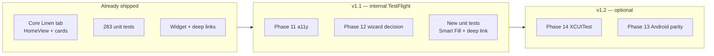

# Linen Tab Master Plan — QA, Risks, Rollout & Observability (Draft)

> **Worker scope:** Testing strategy (unit / UI / manual QA), risks & mitigations, open questions, decision log, migration & rollout, observability, post-launch metrics.
>
> **Companion to:** `docs/superpowers/plans/2026-06-08-linen-tab-master-plan.md` (do not edit main plan from this draft).
>
> **Codebase snapshot:** 2026-06-08 — 283 unit tests in `LinenFlowTests/`, no XCUITest target, Linen tab core workflow complete in `HomeView.swift`. Active work: Phases 11–14 (polish, wizard decision, Android parity, UI tests).

---

## Testing Strategy

### Principles (match existing repo conventions)

1. **TDD for services and ViewModel logic** — write failing `XCTestCase` first, then minimal implementation (per `superpowers:writing-plans` and `Docs/CriteriaChecklist.md`).
2. **Pure calculation in services** — never assert math through SwiftUI; use `LinenCalculatorService`, `ArithmeticParser`, and `FlowViewModel` directly (see `Docs/FinalReport.md` §Protected invariants).
3. **In-memory SwiftData in tests** — standard harness:

```swift
let config = ModelConfiguration(isStoredInMemoryOnly: true)
container = try ModelContainer(
    for: Tower.self, LinenItem.self, DailyLog.self,
    migrationPlan: HimmerFlowMigrationPlan.self,  // when testing migration-sensitive paths
    configurations: config
)
SeedService.seedIfNeeded(context: container.mainContext)
viewModel = FlowViewModel(modelContext: container.mainContext)
```

Pattern source: `LinenFlowTests/FlowViewModelTests.swift`, `LinenFlowTests/DailyLogSaveTests.swift`.

4. **Widget isolation** — call `SharedWidgetStateManager.clear()` in `setUp`/`tearDown` when tests touch delivery or widget sync (`FlowViewModelTests` lines 18–24).
5. **Demo Day as integration fixture** — `viewModel.loadDemoDay()` pins Lagoon 21-floor, 5-item scenario used across `FlowViewModelTests`, `DemoDayFlowTests`, and `DailyLogSaveTests.test_save_succeedsForDemoDay`.
6. **CI gate** — `.github/workflows/ios-ci.yml` runs `xcodebuild test` on scheme `HimmerFlow`; local equivalent in master plan Verification Gates.

### Unit test coverage map (Linen tab)

| Layer | File | Cases | Linen tab relevance |
|-------|------|-------|---------------------|
| ViewModel | `LinenFlowTests/FlowViewModelTests.swift` | 58 | Tower selection, entries, recalculate, validation, `loadFromLog`, `clearEntries`, widget sync, delivery session |
| Save pipeline | `LinenFlowTests/DailyLogSaveTests.swift` | 11 | Save failures, same-day update, snapshot immunity |
| End-to-end numbers | `LinenFlowTests/DemoDayFlowTests.swift` | 11 | Per-floor distribution for Demo Day (Tasks 17/20) |
| Calculator | `LinenFlowTests/CalculatorTests.swift` | 19 | Bundle constants, GI/GW/Diamond distributions, zero-edge cases |
| Arithmetic | `LinenFlowTests/ArithmeticTests.swift` | 26 | Expression input used by `PremiumExpressionInput` |
| Algorithms | `LinenFlowTests/AlgorithmTests.swift` | 39 | Bundle distribution, timeshare reserve, floor algorithms |
| Intelligence | `LinenFlowTests/ShiftIntelligenceServiceTests.swift` | ~15 | Median / same-weekday predictions for Smart Fill |
| Tower floors | `LinenFlowTests/TowerFloorRangeTests.swift` | 12 | GI skip-13, GW/Tapa floor numbering |
| Floor ranges | `LinenFlowTests/FloorRangeBuilderTests.swift` | 8 | Collapsed range labels on cards |
| Diamond example | `LinenFlowTests/DiamondExampleTests.swift` | 12 | Bundle-mode tower, loose-pieces footer |
| Delivery session | `LinenFlowTests/DeliverySessionTests.swift` | 8 | Session lifecycle after Open Delivery |
| Rebalance | `LinenFlowTests/FloorRebalanceServiceTests.swift` | 7 | Short-floor rebalance (wizard path) |
| Reports | `LinenFlowTests/DailyReportServiceTests.swift` | 2 | Insights consume saved logs (downstream) |
| **Stubs (not run)** | `LogFilterBuilderTests.swift`, `TowerConfigServiceTests.swift` | 0 | Features not implemented — do not count toward Linen tab DoD |

**Total active:** 283 cases across 17 files (`Docs/FinalReport.md` test table).

### Unit test gaps to close (prioritized)

| Priority | Gap | Proposed test file / case | Phase |
|----------|-----|---------------------------|-------|
| P0 | No `applySmartFill()` / `smartFillItemCount` coverage | Add `FlowViewModelTests.test_applySmartFill_populatesEntriesFromPredictions` using synthetic logs + `ShiftIntelligenceService` fixtures | 8 |
| P1 | No `OneScreenLinenItemCard` / `HomeView` logic tests (UI-free) | Extract card summary formatting to testable helper OR snapshot-test ViewModel outputs already covered by `DemoDayFlowTests` | 7, 11 |
| P1 | Widget deep link routing | Add `LinenFlowTests/WidgetDeepLinkRouterTests.swift` for `WidgetDeepLink.route(from:)` — pure URL parsing, no UI | 5, 10 |
| P2 | Legacy widget App Group migration | Add tests mirroring `SharedWidgetStateManager.migrateLegacyWidgetState()` with legacy keys `linenflow.widgetState` | 10 |
| P2 | `PremiumCard.isCurrent` wiring | No unit test needed; visual + manual VoiceOver (Phase 11) | 11 |
| P3 | XCUITest happy path | New target `LinenFlowUITests/LinenTabUITests.swift` (Phase 14) | 14 |

### Recommended new unit tests (concrete)

#### Smart Fill (Phase 8)

**File:** `LinenFlowTests/FlowViewModelTests.swift`

```swift
func test_applySmartFill_populatesReceivingEntries() throws {
    let lagoon = try XCTUnwrap(viewModel.availableTowers.first { $0.name == "Lagoon" })
    viewModel.selectTower(lagoon)
    // Insert historical DailyLog via DailyLogSaveService or direct ModelContext insert
    viewModel.refreshShiftIntelligence(from: fetchedLogs)
    XCTAssertGreaterThan(viewModel.smartFillItemCount, 0)
    viewModel.applySmartFill()
    XCTAssertFalse(viewModel.receivingEntries.isEmpty)
}
```

Run: `xcodebuild -project LinenFlow.xcodeproj -scheme HimmerFlow -destination 'platform=iOS Simulator,name=iPhone Air' -only-testing:HimmerFlowTests/FlowViewModelTests/test_applySmartFill_populatesReceivingEntries test`

#### Widget deep link (Phase 5 / 10)

**File:** `LinenFlowTests/WidgetDeepLinkRouterTests.swift` (create)

```swift
func test_deliveryRoute_parsesTowerQuery() {
    let url = URL(string: "himmerflow://widget/delivery?tower=Lagoon")!
    XCTAssertEqual(WidgetDeepLink.route(from: url), .delivery(towerName: "Lagoon"))
}

func test_legacyLinenflowScheme_stillSupported() {
    let url = URL(string: "linenflow://widget/start")!
    XCTAssertEqual(WidgetDeepLink.route(from: url), .start)
}
```

Source: `LinenFlow/Utilities/WidgetDeepLinkRouter.swift` (`supportedSchemes`, `Route` enum).

### UI test strategy (Phase 14 — not yet implemented)

**Current state:** No UI test target (`Docs/FinalReport.md` §Known limitations). `TestPlan.xctestplan` includes only `LinenFlowTests` unit target.

**When adding `LinenFlowUITests`:**

| Test | Steps | Assert |
|------|-------|--------|
| `test_linenTabIsDefault` | Launch app | Tab "Linen" selected; `HomeView` navigation title or tower picker visible |
| `test_selectTowerAndEnterPieces` | Expand tower picker → tap Lagoon → focus Bath Towel card → enter `490` | Summary strip or card shows bundles/pieces |
| `test_saveLogAppearsInLogsTab` | Save Log → switch to Logs tab | New row with tower name "Lagoon" |
| `test_widgetDeepLinkOpensDelivery` | Launch with `himmerflow://widget/delivery?tower=Lagoon` | Delivery command center or bottom chrome state |

**Infrastructure checklist:**

- [ ] Add `LinenFlowUITests` target to `LinenFlow.xcodeproj/project.pbxproj`
- [ ] Set accessibility identifiers on: tower picker rows, first linen card expression field, Save Log button, Logs tab (`AppRootView`)
- [ ] Use same simulator family as CI (`ios-ci.yml` picks first iPhone simulator from `-showdestinations`)
- [ ] Add UI test job step to `.github/workflows/ios-ci.yml` (optional initially — run nightly)

**Lower priority than Phase 11 manual VoiceOver pass** (master plan Phase 14 note).

### Manual QA checklists

#### Template source

Follow structure of `SettingsManagerManualQA.md` (section headers, checkbox bullets, validation messages). The Task 20 checklist in `Docs/BuildLog.md` is **historically accurate for wizard flow only** — use the updated checklist below for the one-screen Linen tab (Architecture update 2026-06-07).

#### Linen tab — smoke path (pre-release, ~15 min)

Run on simulator **and** one physical device (haptics, keyboard).

**Setup:** Fresh install OR Settings → confirm seed towers present. Prefer Lagoon for Demo Day parity with unit tests.

- [ ] **Launch** — App opens to Linen tab (tab 0, `shippingbox.fill`). No crash on cold start (`AppLogger.boot` — check Console filter `subsystem:com.himmerflow category:boot`).
- [ ] **Tower picker** — Expand inline picker on `HomeView`; select **Lagoon** (21 floors). Picker collapses; header shows tower name and accent color.
- [ ] **Item selection** — Open item configuration; enable Bath Towel, Bath Mat, Hand Towel, Washcloth, Pillow Case → Save. Deselected items hidden from card grid.
- [ ] **Empty state intelligence** — With zero entries, if prior logs exist: **Restore Last Log** card visible; if predictions available: **Smart Fill** card visible.
- [ ] **Smart Fill OR manual entry** — Apply Smart Fill **or** enter `490` on Bath Towel card via expression input. Card summary shows bundles/loose; distribution section lists 21 floors (first 7 at 24 pcs, rest 23 — matches `DemoDayFlowTests`).
- [ ] **Arithmetic** — Enter `30+30` on Bath Mat; parsed total 60 without crash (`ArithmeticTests` coverage).
- [ ] **Validation** — Enter partial bundle (e.g. 3 pieces on Hand Towel); warning badge or validation message appears (`FlowViewModelTests.test_validation_*`).
- [ ] **Summary strip** — When multiple entries exist, inline totals for items/pieces/bundles/loose visible.
- [ ] **Save Log** — Tap Save Log; success haptic + confirmation. Switch to **Logs** tab → new Lagoon entry at top.
- [ ] **Snapshot immunity** — Settings → change Bath Mat par → reopen saved log in Logs → counts unchanged (`DailyLogSaveTests.test_savedLog_snapshotIsImmuneToLaterSettingsChanges`).
- [ ] **Clear Entries** — Confirm dialog → entries cleared; delivery session reset (`FlowViewModelTests.test_clearEntries_resetsDeliverySessionAndDeliveryItem`).
- [ ] **Open Delivery** — Bottom chrome navigates to `ShiftCommandCenterView`; pace/checklist UI loads.
- [ ] **Widget pin** — Pin item on card → home screen widget reflects pinned item (App Group `group.com.himmerflow.shared`).
- [ ] **Deep link** — Safari / `xcrun simctl openurl` with `himmerflow://widget/delivery?tower=Lagoon` → Linen tab + delivery push.

#### Linen tab — accessibility pass (Phase 11 gate)

VoiceOver on; Dynamic Type **Accessibility XXXL**.

- [ ] Focused linen card announced with item name and focused state (`HomeView.linenCardAccessibilityLabel` — partial done per `AGENT_WORK_LOG.md`).
- [ ] `PremiumCard.isCurrent` focus ring — single visual indicator (no duplicate stroke overlay on `HomeView.itemCard`).
- [ ] Distribution expand/collapse — label + hint on `OneScreenLinenItemCard`.
- [ ] Expression input — result announced on commit.
- [ ] Trip / widget pills — toggle state announced.
- [ ] XXXL — card grid wraps without clipping; summary strip readable (`minimumScaleFactor` if added).

#### Linen tab — regression matrix (after parallel agent merges)

Run when any agent touches `HomeView.swift`, `OneScreenLinenItemCard.swift`, or `FlowViewModel.swift`:

| Change area | Minimum automated | Minimum manual |
|-------------|-------------------|----------------|
| Calculation / services | Full `xcodebuild test` | Demo Day card numbers spot-check |
| HomeView layout | Build | Smoke path steps 1–6 |
| Save / clear | `DailyLogSaveTests` + `FlowViewModelTests.test_clearEntries_*` | Save + Logs tab |
| Widget sync | `FlowViewModelTests.test_syncWidgetState_*`, `test_startDeliverySessionActivatesWidgetSession` | Widget pin step |
| Deep links | New `WidgetDeepLinkRouterTests` | Deep link step |

#### Settings cross-check (Linen tab dependency)

Reuse `SettingsManagerManualQA.md` sections **Towers & Areas** and **Linen Items** — custom towers must appear in Linen tab inline picker; inactive items hidden from receiving cards.

### Verification commands (copy-paste)

```bash
# Full unit suite (CI parity)
xcodebuild test \
  -project LinenFlow.xcodeproj \
  -scheme HimmerFlow \
  -destination 'platform=iOS Simulator,name=iPhone Air' \
  -resultBundlePath TestResults.xcresult

# Linen-critical subset (~2 min)
xcodebuild test \
  -project LinenFlow.xcodeproj \
  -scheme HimmerFlow \
  -destination 'platform=iOS Simulator,name=iPhone Air' \
  -only-testing:HimmerFlowTests/FlowViewModelTests \
  -only-testing:HimmerFlowTests/DailyLogSaveTests \
  -only-testing:HimmerFlowTests/DemoDayFlowTests \
  -only-testing:HimmerFlowTests/CalculatorTests \
  -only-testing:HimmerFlowTests/ArithmeticTests \
  -only-testing:HimmerFlowTests/ShiftIntelligenceServiceTests

# Build only (after UI-only changes)
xcodebuild build \
  -project LinenFlow.xcodeproj \
  -scheme HimmerFlow \
  -destination 'platform=iOS Simulator,name=iPhone Air'
```

Expected: **TEST SUCCEEDED**, 283+ tests (283 today; +N when new cases land).

---

## Risks & Mitigations

| ID | Risk | Likelihood | Impact | Mitigation | Owner track |
|----|------|------------|--------|------------|-------------|
| R-01 | **Parallel edits to `HomeView.swift`** — merge conflicts, broken navigation | High | High | `AGENT_WORK_LOG.md` claims; file ownership map in master plan; serialize Agents 1 & 2 per Recommended Parallel Dispatch | All |
| R-02 | **Calculation drift into views** — inline math in SwiftUI breaks invariants | Medium | Critical | Code review gate: no totals in Views; extend `CalculatorTests` for new items; `Docs/FinalReport.md` invariant #3 | A |
| R-03 | **Bundle constant change** — accidental edit to `BundleLibrary` | Low | Critical | `CalculatorTests.test_bundleLibrary_defaultSeedValues`; Settings shows "locked" copy | A |
| R-04 | **Snapshot corruption** — `DailyLog` decode fails after model change | Low | High | Keep snapshot structs backward-compatible; add decode test in `DailyLogSaveTests`; avoid editing encoded fields without migration | G |
| R-05 | **Widget / app state desync** — App Group write fails silently | Medium | Medium | `FlowViewModelTests` widget tests; manual widget pin step; log via `AppLogger.widget` on save failure (add if missing) | H |
| R-06 | **Legacy URL / App Group users** — `linenflow://` or `group.com.linenflow.shared` | Medium | Low | Keep dual scheme in `WidgetDeepLink.supportedSchemes`; `SharedWidgetStateManager.migrateLegacyWidgetState()`; test migration | C, H |
| R-07 | **Wizard removal breaks hidden users** — someone relied on `FlowStep` navigation | Low | Medium | Phase 12 decision: prefer Option A with release note; optional compile-time `#if DEBUG` wizard entry before delete | J |
| R-08 | **Smart Fill wrong quantities** — bad historical data → wrong prefill | Medium | Medium | Show confidence + sample count on `SmartFillCard`; user must confirm Apply; unit tests with controlled logs (`ShiftIntelligenceServiceTests` patterns) | F |
| R-09 | **VoiceOver gaps ship** — silent controls on production path | Medium | Medium | Phase 11 checklist; block v1.1 on SC-12–SC-14 from phases draft | I |
| R-10 | **No UI tests** — regressions caught late | High | Medium | Manual smoke checklist every merge to `HomeView`/`FlowViewModel`; Phase 14 XCUITest for happy path | L |
| R-11 | **iOS 26-only deployment** — older devices excluded | Low | Low | Document in README; intentional per `IPHONEOS_DEPLOYMENT_TARGET = 26.0` | — |
| R-12 | **Android parity confusion** — iOS Linen tab changes without Android update | Medium | Low | Track K separate; document parity gaps in decision log | K |
| R-13 | **SwiftData V1→V2 migration** — shift models added alongside linen models | Low | Medium | `HimmerFlowMigrationPlan` lightweight stage; linen models unchanged in V2 | A |
| R-14 | **Keyboard / pinned editor** — `KeyboardPinnedEditorShell` layout bugs on small phones | Medium | Medium | Manual step with keyboard show/hide; Dynamic Type XXXL pass | I |
| R-15 | **CI simulator drift** — GitHub `macos-15` picks different iPhone sim than local | Medium | Low | CI uses dynamic simulator ID; document local `-showdestinations` fallback | Infra |

### Risk acceptance (explicit)

- **No iCloud sync** — accepted; local-only per `Docs/FinalReport.md`.
- **No remote feature flags** — accepted; rollouts are App Store releases + idempotent on-device migrations.
- **Stub test files** — `LogFilterBuilderTests`, `TowerConfigServiceTests` remain disabled until features exist.

---

## Open Questions

| ID | Question | Options | Default if unresolved | Blocks |
|----|----------|---------|----------------------|--------|
| OQ-01 | **Wizard fate (Phase 12)** | A: Remove orphan navigation · B: Wizard mode button · C: Archive folder | **A** (master plan recommendation) | J, docs |
| OQ-02 | **XCUITest in CI** | Run on every PR vs nightly vs manual only | Manual only until identifiers stable | L, CI cost |
| OQ-03 | **Smart Fill minimum sample count** | Require N≥2 logs before showing card vs show with N=1 | Match `ShiftIntelligenceService` current behavior; document in UI | F |
| OQ-04 | **Post-launch analytics** | OSLog counters only vs future TelemetryDeck/Firebase | OSLog + manual log review for v1.1 | Metrics section |
| OQ-05 | **`PremiumCard.isCurrent` + external stroke** | Remove overlay first vs wire `isCurrent` first | Wire `isCurrent` then remove overlay in same PR | I |
| OQ-06 | **Dedicated Linen tab manual QA doc** | New `LinenTabManualQA.md` vs extend `SettingsManagerManualQA.md` | New file at repo root (mirror Settings doc) | QA process |
| OQ-07 | **Android Smart Fill timeline** | Same release as iOS v1.1 vs later | Later (Track K stretch) | K |
| OQ-08 | **Save Log when validation warnings** | Block save vs allow with warning banner | Current: disable Save when validation blocks (verify in `HomeView`) | G |
| OQ-09 | **Feature toggle for one-screen vs wizard** | UserDefaults debug flag for rollback | No — binary choice per Phase 12 | J |
| OQ-10 | **Test count gate** | Hard fail CI if `< 283` tests | Keep 283 as floor; update docs when adding tests | CI |

---

## Decision Log

| Date | ID | Decision | Rationale | Alternatives rejected |
|------|-----|----------|-----------|----------------------|
| 2026-05-16 | D-01 | Daily logs store **encoded snapshots**, not live `@Model` refs | Audit trail / settings immunity | Live relationships |
| 2026-05-16 | D-02 | Calculations live in **services**, not SwiftUI | Testability + invariant enforcement | View-local math |
| 2026-06-07 | D-03 | **Linen tab = `HomeView`**, not separate `LinenTabView` | Single screen, inline tower picker | `TowerSelectionView` route |
| 2026-06-07 | D-04 | **One-screen cards** primary; wizard via `FlowStep` dormant | Faster attendant workflow | Wizard-only flow |
| 2026-06-07 | D-05 | **283 unit tests** as release gate; no UI tests yet | Coverage on calculator/VM; UI cost deferred | Ship without tests |
| 2026-06-07 | D-06 | **App Group** `group.com.himmerflow.shared` with legacy migration | Rebrand from LinenFlow; preserve widget state | Clean break (data loss) |
| 2026-06-07 | D-07 | **Dual URL schemes** `linenflow` + `himmerflow` | Existing widgets/bookmarks | HimmerFlow-only scheme |
| 2026-06-08 | D-08 | Phase 11 **P0: `isCurrent` wiring** before VoiceOver depth | Removes duplicate focus indicator | VoiceOver-first |
| 2026-06-08 | D-09 | **Parallel agents** coordinate via `AGENT_WORK_LOG.md` | Prevent `HomeView` merge conflicts | Ad-hoc editing |
| *Pending* | D-10 | Wizard **Option A** — remove orphan `navigationDestination` | Dead code; confuses docs | B: wizard mode, C: archive only |
| *Pending* | D-11 | Add **`LinenTabManualQA.md`** at repo root | Discoverability for attendants/QA | Fold into BuildLog only |
| *Pending* | D-12 | Add **`WidgetDeepLinkRouterTests`** | Cheap pure-URL coverage | UI test only |

---

## Migration & Rollout

### Current rollout model (no remote feature flags)

The codebase does **not** use LaunchDarkly, Firebase Remote Config, or `@AppStorage` feature flags for Linen tab behavior. Rollout patterns in use:

| Pattern | Implementation | Linen tab impact |
|---------|------------------|------------------|
| **Idempotent UserDefaults migration** | One-shot keys e.g. `himmerflow.migratedFromLinenFlow`, `himmerflow.migratedFromSmartShiftPlanner`, `himmerflow.migratedUserDefaultsFromLinenFlow` | Widget state + legacy shift data migrate on boot |
| **SwiftData lightweight migration** | `HimmerFlowMigrationPlan` V1→V2 adds shift models; **Linen models unchanged** | No Linen tab data migration required for V2 |
| **Legacy App Group** | `SharedWidgetStateManager.legacyAppGroupID` = `group.com.linenflow.shared` | Widget reads old state once, rewrites to `group.com.himmerflow.shared` |
| **Legacy URL schemes** | `WidgetDeepLink.supportedSchemes` = `linenflow`, `himmerflow` | Widget deep links keep working |
| **Legacy UserDefaults key remap** | `FlowViewModel.migrateLegacyUserDefaultsKeys()` | Pinned widget items, trip items |
| **Property mode flag** | `@AppStorage("isCustomProperty")` on `HomeView` | Custom vs default property behavior — not a Linen tab rollout gate |

### Release phases (Linen tab v1.1 polish)



| Phase | Audience | Entry criteria | Exit criteria |
|-------|----------|----------------|---------------|
| **Dev / main** | Agents + developer | CI green | `xcodebuild test` 283+ pass |
| **TestFlight internal** | Hotel pilot users | v1.1 branches merged; manual smoke + VoiceOver pass | No P0/P1 bugs; SC-12–SC-15 closed |
| **App Store** | Production attendants | TestFlight sign-off | Same + updated release notes for wizard removal (if D-10) |

### Migration checklist (upgraders from pre–one-screen builds)

- [ ] Boot once on new build — confirm no SwiftData crash (`HimmerFlowApp` ModelContainer init logs via `AppLogger.boot`).
- [ ] Widget still shows delivery state — triggers `SharedWidgetStateManager.migrateLegacyWidgetState()` if needed.
- [ ] Old `linenflow://widget/...` bookmarks open Linen tab.
- [ ] Saved **DailyLogs** intact — spot-check oldest log in Logs tab (snapshot decode).
- [ ] No duplicate logs on same-day re-save — `DailyLogSaveTests.test_save_sameDaySameTower_updatesInPlace`.

### Rollback strategy

| Change type | Rollback |
|-------------|----------|
| UI/a11y (Phase 11) | Revert PR; no data migration |
| Wizard removal (Phase 12 A) | Revert PR; wizard views still in repo until deleted |
| Widget key format change | **Avoid** without new migration key; extend `SharedWidgetState` with optional fields |
| SwiftData schema break | Requires new `HimmerFlowSchemaV3` + migration stage — **out of scope** for Linen tab polish |

### Recommended: pre-merge rollout gate for Linen tab PRs

1. Claim files in `AGENT_WORK_LOG.md`.
2. Run Linen-critical `xcodebuild test` subset (commands above).
3. Complete **smoke path** checklist (15 min).
4. If touching a11y: complete **accessibility pass** subset.
5. Attach test result summary to `AGENT_WORK_LOG.md` Completed Work row.

---

## Observability

### Current instrumentation (no third-party analytics)

| System | Location | Categories / use |
|--------|----------|------------------|
| **AppLogger** (OSLog) | `LinenFlow/Utilities/AppLogger.swift` | `boot`, `seed`, `session`, `widget`, `logs`, `save`, `liveactivity` |
| **HimmerFlowLog** | `LinenFlow/Utilities/Logging.swift` | `orchestrator`, `reconciliation`, `notifications`, `location`, `liveActivity`, `persistence` |
| **Widget logger** | `SharedWidgetStateManager.swift` | Decode failures, legacy migration info |
| **Shift orchestrator** | `ShiftOrchestrator.swift` | Shift tab / live activity (adjacent to Linen delivery handoff) |

**Console filters (debugging Linen tab):**

```
subsystem:com.himmerflow.app category:session
subsystem:com.himmerflow.app category:save
subsystem:com.himmerflow.app category:widget
```

### Gaps & recommended additions (minimal, no new dependencies)

| Event | Suggested log | File |
|-------|---------------|------|
| Save Log success/failure | `AppLogger.save.info/error` with tower name + entry count | `DailyLogSaveService.swift` |
| Smart Fill applied | `AppLogger.session.info("SmartFill applied \(count) items")` | `FlowViewModel.applySmartFill()` |
| Restore last log | `AppLogger.session.info("Restored log \(log.id)")` | `FlowViewModel.loadFromLog` |
| Clear entries | `AppLogger.session.info("Cleared entries")` | `FlowViewModel.clearEntries()` |
| Widget sync write failure | `AppLogger.widget.error` when encode fails | `FlowViewModel.syncWidgetState` |
| Deep link handled | `AppLogger.session.info` with route enum | `WidgetDeepLinkCoordinator.handle` |

Use `.public` privacy for non-PII fields (tower **names** are operational, not user PII). Avoid logging piece counts per floor in production if log volume matters — aggregate is enough.

### What we deliberately do not log

- Full arithmetic expressions (noise).
- SwiftData SQL / model IDs in production (debug only).
- Location coordinates (Shift tab — `HimmerFlowLog.location` already segregated).

---

## Post-Launch Metrics

No analytics SDK is integrated. For v1.1, use **proxy metrics** until OQ-04 is resolved.

### Tier 1 — CI / quality (automated)

| Metric | Target | Source |
|--------|--------|--------|
| Unit test pass rate | 100% | GitHub Actions `ios-ci.yml` |
| Test count floor | ≥ 283 | `grep -c "func test" LinenFlowTests/*.swift` |
| Build success | 100% on `main` | `ios-ci.yml` build step |
| UI test pass rate | 100% when Phase 14 lands | Future CI job |

### Tier 2 — Operational (manual / TestFlight feedback)

| Metric | How to measure | Success signal |
|--------|----------------|----------------|
| Smoke path completion time | QA times 15-min checklist | < 15 min for new attendant |
| VoiceOver blockers | Phase 11 audit | Zero silent controls on happy path |
| Save Log failure reports | User feedback + `AppLogger.save` errors | Zero unexplained failures |
| Widget desync reports | User feedback | Pin on card matches widget |
| Smart Fill trust | Pilot interviews | Users understand Apply is optional |

### Tier 3 — Product outcomes (weekly review)

| Metric | Definition | Data source |
|--------|------------|-------------|
| Logs saved per tower per day | Count `DailyLog` inserts | SwiftData fetch / future export |
| Smart Fill adoption | Logs where entries match prediction within 5% | Requires OQ-04 instrumentation |
| Restore Last Log usage | Restore actions / empty-entry sessions | `AppLogger.session` (after added) |
| Open Delivery conversion | Sessions reaching `ShiftCommandCenterView` with entries | Manual observation / future log |
| Time to first Save Log | Launch → first save | Stopwatch on pilot shifts |

### Suggested v1.2 instrumentation (if analytics approved)

1. Lightweight **OSLog signposts** for `SaveLog`, `SmartFill`, `OpenDelivery` — aggregate in Instruments / MetricKit.
2. Optional **TelemetryDeck** or App Store Connect engagement — privacy-preserving, no piece-level data.
3. **XCUITest duration** in CI as perf regression guard for Linen tab launch.

### Post-launch review cadence

| When | Action |
|------|--------|
| Day 1 after TestFlight | Run full smoke + accessibility checklists; scan Console for `category:save` errors |
| Week 1 | Review pilot feedback; tally R-08 Smart Fill mispredictions |
| Week 4 | Compare logs/tower/day vs pre-one-screen baseline; decide on XCUITest CI (OQ-02) |
| After Phase 12 merge | Update `Docs/FinalReport.md` and retire wizard references in `Docs/BuildLog.md` manual section |

---

## Cross-References

| Document | Relevance |
|----------|-----------|
| `docs/superpowers/plans/2026-06-08-linen-tab-master-plan.md` | Verification Gates, Phase 11–14, File Ownership |
| `docs/superpowers/plans/2026-06-08-linen-tab-master-plan.draft-phases.md` | SC-12–SC-17 success criteria gaps |
| `Docs/FinalReport.md` | Test table, known limitations, build commands |
| `Docs/CriteriaChecklist.md` | Protected invariants, test counts |
| `Docs/BuildLog.md` | Historical manual checklist (wizard era) |
| `SettingsManagerManualQA.md` | Manual QA doc template |
| `AGENT_WORK_LOG.md` | Parallel agent coordination |
| `.github/workflows/ios-ci.yml` | CI test command |
| `TestPlan.xctestplan` | Unit test target configuration |

---

*Draft generated 2026-06-08 by QA/Risks parallel worker. Align with main plan merge; do not edit sibling draft files.*
