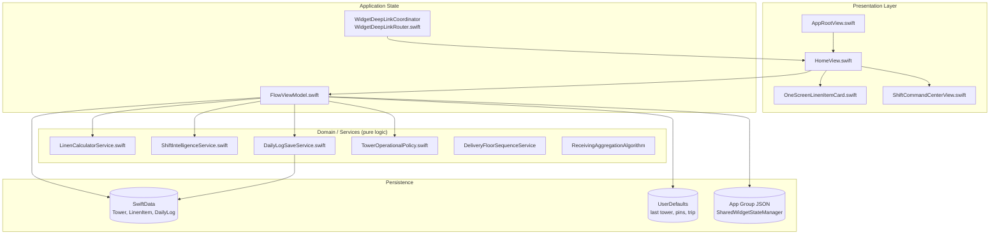
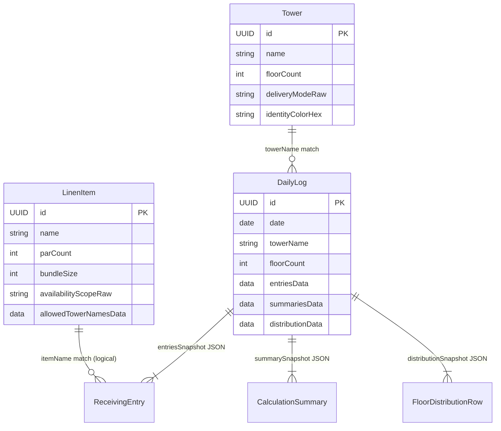
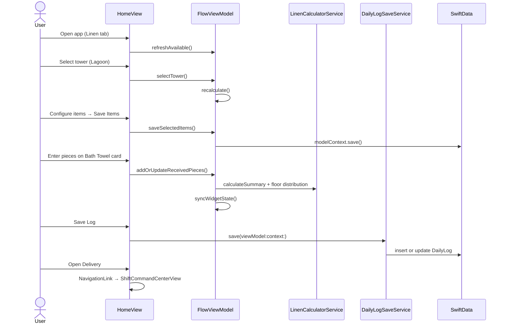
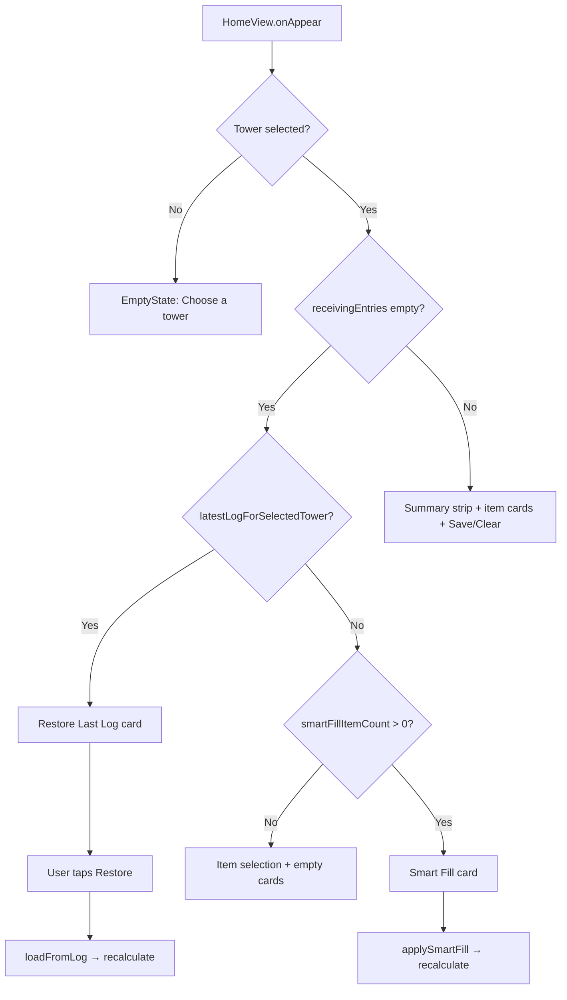
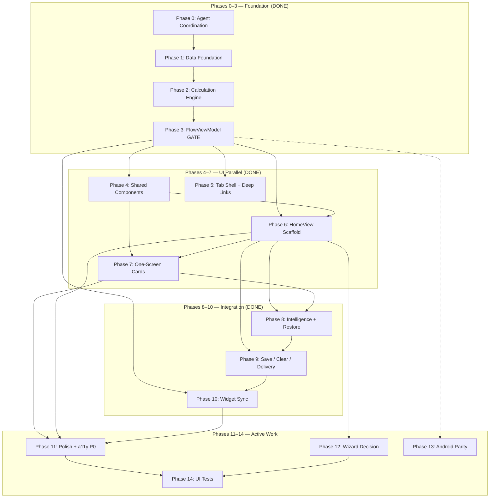
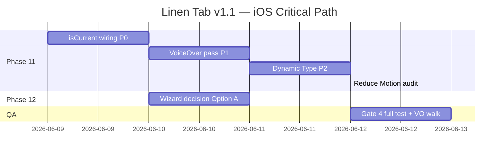
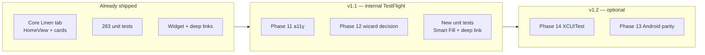

# Linen Tab — Grand Master Plan (Expanded)

> **For agentic workers:** REQUIRED SUB-SKILL: Use `superpowers:subagent-driven-development` (recommended) or `superpowers:executing-plans` to implement tracks task-by-task. Steps use checkbox (`- [ ]`) syntax for tracking.
>
> **Coordination file:** Claim work in `AGENT_WORK_LOG.md` before touching files. Never edit the same file from two parallel agents.

**Goal:** Build and maintain the **Linen tab** — the primary operational surface where hotel linen attendants select a tower, enter received inventory, see inline calculations and per-floor distribution, save daily logs, and open live delivery guidance.

**Architecture:** The Linen tab is **not** a separate `LinenTabView`. It is tab index 0 in `AppRootView`, labeled "Linen", deep-link key `.home`, root view **`HomeView`**. State lives in app-scoped **`FlowViewModel`**; calculations live in **`LinenCalculatorService`** (never in views). The primary UX is a **one-screen card grid** (`OneScreenLinenItemCard`) that supersedes the older multi-step wizard.

**Tech Stack:** SwiftUI, SwiftData (`@Model` + `@Query`), `@Observable` ViewModels, WidgetKit App Group sync, iOS 26.0, Xcode 26.x.

**Current status (2026-06-08):** Core Linen tab workflow is **production-complete** (Phases 0–10 ✅). Active work: Phases 11–14 (polish, wizard decision, Android parity, UI tests). **283 unit tests** passing.

---

## Table of Contents

1. [Goals](#1-goals)
2. [Success Criteria](#2-success-criteria)
3. [Non-Goals](#3-non-goals)
4. [Architecture Overview](#4-architecture-overview)
5. [Architecture Decisions](#5-architecture-decisions)
6. [Data Model](#6-data-model)
7. [API & Persistence](#7-api--persistence)
8. [UI/UX Flows](#8-uiux-flows)
9. [Screen Inventory](#9-screen-inventory)
10. [Edge Cases & Failure Modes](#10-edge-cases--failure-modes)
11. [Accessibility](#11-accessibility)
12. [Parallel Execution Matrix](#12-parallel-execution-matrix)
13. [Phase Overview & Dependencies](#13-phase-overview--dependencies)
14. [Implementation Phases (0–14)](#implementation-phases-014)
15. [Effort Estimates](#effort-estimates-consolidated)
16. [Timeline & Milestones](#timeline)
17. [Testing Strategy](#testing-strategy)
18. [Risks & Mitigations](#risks--mitigations)
19. [Open Questions](#open-questions)
20. [Decision Log](#decision-log)
21. [Migration & Rollout](#migration--rollout)
22. [Observability](#observability)
23. [Post-Launch Metrics](#post-launch-metrics)
24. [Verification Gates](#verification-gates)
25. [File Ownership Map](#file-ownership-map)
26. [Recommended Parallel Dispatch](#recommended-parallel-dispatch-4-agents)
27. [Commit Strategy](#commit-strategy)
28. [Cross-Reference Index](#cross-reference-index)

---

## 1. Goals

### Primary goal

Deliver and maintain the **Linen tab** as the hotel attendant's primary operational surface: select a tower, configure active linen items, enter received inventory with safe arithmetic, see inline bundle math and per-floor distribution, persist immutable daily logs, and hand off to live delivery guidance — all without leaving the one-screen card grid.

### Supporting goals

| # | Goal | Primary code anchor |
|---|------|---------------------|
| G1 | **Single-screen dominance** — one-screen cards (`OneScreenLinenItemCard`) are the default path; multi-step wizard is optional or removed | `LinenFlow/Views/HomeView.swift`, `LinenFlow/Views/Flow/OneScreenLinenItemCard.swift` |
| G2 | **Calculation integrity** — all bundle/floor math lives in services, never in views | `LinenFlow/Services/LinenCalculatorService.swift`, `LinenFlow/Services/BundleLibrary.swift` |
| G3 | **Immutable audit trail** — daily logs store encoded snapshots, not live model references | `LinenFlow/Models/DailyLog.swift`, `LinenFlow/Services/DailyLogSaveService.swift` |
| G4 | **Shift intelligence** — Smart Fill and Restore Last Log reduce repetitive data entry | `LinenFlow/Services/ShiftIntelligenceService.swift`, `HomeView` `smartFillCard` / `useLastLogCard` |
| G5 | **Delivery handoff** — Linen tab opens `ShiftCommandCenterView` for pace, trips, and floor completion | `HomeView` `shiftCommanderStartButton`, `LinenFlow/Views/Flow/ShiftCommandCenterView.swift` |
| G6 | **Widget continuity** — App Group sync keeps home-screen widget and Live Activity aligned with Linen tab state | `LinenFlow/Services/SharedWidgetStateManager.swift`, `FlowViewModel.syncWidgetState` |
| G7 | **Deep-link landing** — widget URLs open Linen tab and optionally push delivery command center | `LinenFlow/Utilities/WidgetDeepLinkRouter.swift`, `AppRootView.swift` |
| G8 | **Parallel-safe maintenance** — agents coordinate via `AGENT_WORK_LOG.md`; high-conflict files serialized | `AGENT_WORK_LOG.md` (repo root) |

### Outcome statement

An attendant on a 21-floor tower can: pick Lagoon → save 6 active items → Smart Fill or enter pieces on cards → see distribution rows update → Save Log → Open Delivery — in under 3 minutes, with VoiceOver and Dynamic Type support, and 283+ unit tests green.

---

## 2. Success Criteria

Criteria are **measurable** and map to verification commands or manual checks. Status reflects codebase as of 2026-06-08.

| ID | Criterion | Status | Verification |
|----|-----------|--------|--------------|
| SC-01 | Linen tab is tab index 0 with `shippingbox.fill` label | ✅ Done | `AppRootView.swift` lines 11–15 |
| SC-02 | Tower selection is inline (no `TowerSelectionView` route) | ✅ Done | `HomeView` `towerPicker` collapsed/expanded states |
| SC-03 | Per-tower item checklist persists to SwiftData | ✅ Done | `saveSelectedTowerItems()` → `FlowViewModel.saveSelectedItems` |
| SC-04 | Arithmetic expression entry evaluates safely | ✅ Done | `PremiumExpressionInput` → `ArithmeticParser` (26 tests) |
| SC-05 | Inline summary + floor distribution on each entry | ✅ Done | `FlowViewModel.recalculate()` → `deliveryFloorDistributions` |
| SC-06 | Smart Fill and Restore Last Log when entries empty | ✅ Done | `HomeView` `smartFillCard`, `useLastLogCard` |
| SC-07 | Save Log writes immutable snapshot | ✅ Done | `DailyLogSaveService` + `DailyLogSaveTests` (11 cases) |
| SC-08 | Clear Entries with confirmation dialog | ✅ Done | `HomeView` `showClearConfirmation` → `clearEntries()` |
| SC-09 | Open Delivery navigates to command center | ✅ Done | `bottomChrome` `NavigationLink` + deep-link `showDeliveryCommandCenter` |
| SC-10 | Widget deep links land on Linen tab | ✅ Done | `WidgetDeepLinkCoordinator.handle` routes `.home` |
| SC-11 | Unit test suite ≥ 283 cases pass | ✅ Done | `xcodebuild test` (see Verification Gates) |
| SC-12 | Focused card uses `PremiumCard.isCurrent` (no duplicate stroke) | ⬜ **Gap** | `PremiumCard.swift` has API; `OneScreenLinenItemCard` does not pass `isCurrent`; `HomeView` lines 905–908 add duplicate overlay |
| SC-13 | VoiceOver covers distribution, expression input, trip pills | 🟡 Partial | `HomeView` card labels done (2026-06-07); `OneScreenLinenItemCard` distribution/input gaps remain per `AGENT_WORK_LOG.md` |
| SC-14 | Dynamic Type XXXL on card grid without clipping | ⬜ **Gap** | Manual audit on `OneScreenLinenItemCard` + `slimSummaryContent` |
| SC-15 | Wizard flow decision documented and implemented | ⬜ **Open** | `HomeView` registers `FlowStep` destinations but never `flowPath.append` from root |
| SC-16 | Android Linen screen parity (smart fill, inline distribution) | 🟡 Partial | `android/app/src/main/java/com/himmerflow/android/` — basics done, gaps listed in Phase 13 |
| SC-17 | XCUITest happy-path coverage | ⬜ **Gap** | No `LinenFlowUITests` target (noted in `Docs/FinalReport.md`) |

**Definition of done (Linen tab v1.1):** SC-01 through SC-11 ✅ (already met) **plus** SC-12, SC-13, SC-14, SC-15 resolved. SC-16 and SC-17 are stretch goals for v1.2.

---

---

## 3. Non-Goals

Explicitly **out of scope** for this master plan to prevent scope creep:

| # | Non-goal | Rationale |
|---|----------|-----------|
| NG-01 | **Shift tab redesign** | Owned by Shift/HimmerFlow migration plan; Linen tab only hands off via Open Delivery |
| NG-02 | **Insights tab analytics** | `InsightsView` + `DailyReportService` are separate; Linen tab only produces log data they consume |
| NG-03 | **Settings / tower calibration UX** | `SettingsView`, `TowerCalibrationView` — attendants configure towers elsewhere |
| NG-04 | **LogFilterBuilder implementation** | Test stub only (`LinenFlowTests/LogFilterBuilderTests.swift`); Logs tab filtering is a separate feature |
| NG-05 | **TowerConfigService implementation** | Test stub only (`LinenFlowTests/TowerConfigServiceTests.swift`); tower CRUD beyond floor count stepper is Settings scope |
| NG-06 | **Re-homing legacy Shift delivery UI** | `ShiftTabView+LegacyDeliveryContent.swift` is archived reference, not Linen tab wiring |
| NG-07 | **Changing protected bundle constants** | `BundleLibrary.swift` constants are invariant per `Docs/CriteriaChecklist.md` |
| NG-08 | **SwiftData schema migration for DailyLog** | Snapshots are version-tolerant Codable blobs; no migration work unless model shape breaks decode |
| NG-09 | **New linen item types or tower seed data** | `DefaultData.swift` 5 towers / 11 items are fixed unless product explicitly requests |
| NG-10 | **Backend / cloud sync** | Local-first SwiftData + App Group only |
| NG-11 | **Renaming app from HimmerFlow branding** | Cosmetic; does not block Linen tab function |

---

---


## 4. Architecture Overview

The Linen tab is the app's primary operational surface for hotel linen attendants. It is **not** a dedicated `LinenTabView`; it is tab index 0 in `AppRootView`, labeled "Linen", with deep-link key `.home` and root view `HomeView`.



**Rationale:** Views stay thin; all calculation and validation live in testable services. `FlowViewModel` is the single source of truth for in-progress shift data. SwiftData stores durable configuration and historical logs; ephemeral session state stays in memory + UserDefaults.

---

## 5. Architecture Decisions

### AD-1: One-screen flow supersedes multi-step wizard

| | |
|---|---|
| **Decision** | Primary UX is inline entry on `HomeView` via `OneScreenLinenItemCard`; wizard screens remain registered but unused. |
| **Rationale** | Attendants work one item at a time on the floor; scrolling a card grid beats pushing 4 navigation steps. |
| **Evidence** | `HomeView` defines `FlowStep` destinations (`ReceivingView`, `ReviewReceivedView`, `ResultsView`, `FloorDistributionView`) but **never** calls `flowPath.append`. |
| **Alternatives** | **A (recommended):** Remove orphan `navigationDestination(for: FlowStep.self)` — see Phase 12 in master plan. **B:** Add "Wizard mode" toolbar entry. **C:** Move wizard views to `Views/Flow/Legacy/` and exclude from target. |
| **Files** | `LinenFlow/Views/HomeView.swift:4-10,49-61`, `LinenFlow/Views/Flow/ReceivingView.swift`, etc. |

### AD-2: In-memory receiving state + immutable log snapshots

| | |
|---|---|
| **Decision** | Active shift data (`receivingEntries`, summaries, distributions) lives in `FlowViewModel` memory. Persist only on explicit Save via `DailyLogSaveService`. |
| **Rationale** | Fast recalculation on every keystroke; logs are audit snapshots, not live editable records. |
| **Alternatives** | **Rejected:** Auto-save draft to SwiftData — adds merge complexity and stale-state bugs on app kill. **Rejected:** Core Data live objects for entries — harder to test, couples UI to persistence. |
| **Files** | `FlowViewModel.swift:67-72`, `DailyLog.swift`, `DailyLogSaveService.swift` |

### AD-3: Tower–item availability encoded on `LinenItem`, not a join table

| | |
|---|---|
| **Decision** | Per-tower item selection mutates `LinenItem.availabilityScope` + `allowedTowerNames` JSON blob. |
| **Rationale** | Matches existing Settings editor pattern; no extra `@Model` for tower–item pairs. |
| **Alternatives** | **TowerItemConfig join model** — cleaner relational model but requires migration + Settings refactor. **Per-tower UserDefaults sets** — loses sync with Settings UI. |
| **Files** | `LinenItem.swift:55-88`, `ItemAvailabilityScope.swift`, `FlowViewModel.saveSelectedItems` at `FlowViewModel.swift:286-316` |

### AD-4: Same-day log upsert (one log per tower per calendar day)

| | |
|---|---|
| **Decision** | `DailyLogSaveService.save` updates existing same-day log for tower instead of inserting duplicate. |
| **Rationale** | Attendants may save multiple times during a shift; Logs tab should show one canonical record per day. |
| **Alternatives** | **Append-only history** — better audit trail but clutters Logs UI. **Versioned logs** — overkill for v1. |
| **Files** | `DailyLogSaveService.swift:37-67`, `DailyLog.update` at `DailyLog.swift:52-65` |

### AD-5: Widget sync on every `recalculate()`

| | |
|---|---|
| **Decision** | `FlowViewModel.recalculate()` always calls `syncWidgetState()` at end. |
| **Rationale** | Home screen widget must reflect latest counts, pins, and floor progress without separate subscription layer. |
| **Alternatives** | **Debounced sync** — reduces App Group writes but risks stale widget after rapid entry. **Combine pipeline** — heavier than needed. |
| **Files** | `FlowViewModel.swift:966-1036`, `SharedWidgetStateManager.swift`, `SharedWidgetState.swift` |

### AD-6: Tower operational policy as code constants

| | |
|---|---|
| **Decision** | Known Hilton towers get locked floor counts and par-system rules via `TowerOperationalPolicy`. |
| **Rationale** | Prevents attendants from accidentally setting Lagoon to 40 floors; timeshare towers skip par caps. |
| **Alternatives** | **All floor counts editable** — caused production miscounts. **Full SwiftData policy table** — flexible but seed-heavy. |
| **Files** | `TowerOperationalPolicy.swift`, used in `HomeView.swift:622-664`, `FlowViewModel.recalculate` |

### AD-7: App-scoped `FlowViewModel` injected at boot

| | |
|---|---|
| **Decision** | Single `FlowViewModel` created in `HimmerFlowApp.init`, injected via `.environment(flowViewModel)`. |
| **Rationale** | Linen tab, widgets, and delivery command center share one session; tower/entries survive tab switches. |
| **Alternatives** | **Per-tab ViewModel** — breaks widget pin + delivery continuity. **@Query-driven state** — wrong tool for ephemeral entries. |
| **Files** | `HimmerFlowApp.swift:71-77,115`, `AppRootView.swift:5` |

---

## 6. Data Model

### 3.1 SwiftData entities (`@Model`)

| Entity | File | Purpose | Key fields |
|--------|------|---------|------------|
| `Tower` | `Models/Tower.swift` | Property towers | `name`, `floorCount`, `deliveryModeRaw`, `identityColorHex`, `startFloor`/`topFloor`, geo calibration |
| `LinenItem` | `Models/LinenItem.swift` | Catalog + par config | `name`, `parCount`, `countMethodRaw`, `bundleSize`, `allowedTowerNamesData`, `availabilityScopeRaw` |
| `DailyLog` | `Models/DailyLog.swift` | Immutable shift snapshot | JSON blobs: `entriesData`, `summariesData`, `distributionData` |

Schema registration and migration: `HimmerFlowApp.swift:46-54`, `HimmerFlowMigrationPlan.swift` (V1: Tower/LinenItem/DailyLog → V2 adds shift models).

Seed data: `SeedService.swift`, `SeedData/DefaultData.swift`.

### 3.2 Value types (Codable, in-memory + log snapshots)

| Type | File | Role |
|------|------|------|
| `ReceivingEntry` | `Models/ReceivingEntry.swift` | One received line (pieces, bins, method) |
| `CalculationSummary` | `Models/CalculationSummary.swift` | Par/overage/shortage summary per item |
| `FloorDistributionRow` | `Models/FloorDistributionRow.swift` | Per-floor piece/bundle allocation |
| `CountMethod` | `Models/CountMethod.swift` | `.fixedBin`, `.manualPieces`, `.cartLabelPieces` |
| `CalculationStatus` | `Models/CalculationStatus.swift` | `.exact`, `.overage`, `.shortage` |
| `ItemSupplyPrediction` | `Models/ShiftIntelligenceModels.swift` | Smart fill prediction |
| `SharedWidgetState` | `Models/SharedWidgetState.swift` | Widget/Live Activity payload |

### 3.3 Display grouping (computed, not persisted)

| Enum | File | Used by |
|------|------|---------|
| `TowerDisplayGroup` | `Tower.swift:9-40` | Tower picker sections (piece vs bundle towers) |
| `LinenItemDisplayGroup` | `LinenItem.swift:4-40` | Item card sections (bath/bedding/specialty) |

### 3.4 Entity relationship diagram



**Note:** No foreign keys — `DailyLog.towerName` and entry `itemName` are denormalized strings for snapshot stability if catalog changes later.

---

## 7. API & Persistence

### 4.1 FlowViewModel public API (Linen tab contract)

| Method / property | Purpose | Triggers |
|-------------------|---------|----------|
| `selectTower(_:)` | Set tower, reset trip on change | Tower picker |
| `updateSelectedTowerFloorCount(_:)` | Persist floor count (unless protected) | Stepper in picker |
| `saveSelectedItems(_:for:)` | Persist item availability | Item selection card Save |
| `addOrUpdateReceivedPieces(item:pieces:)` | Primary one-screen entry | `OneScreenLinenItemCard` |
| `recalculate()` | Rebuild summaries + distributions + widget | After any entry change |
| `clearEntries()` | Reset entries, notes, delivery session | Clear confirmation |
| `loadFromLog(_:)` | Restore from snapshot | Restore Last Log card |
| `applySmartFill()` | Fill from predictions | Smart Fill card |
| `updateShiftIntelligence(from:)` | Refresh predictions | `@Query` logs change |
| `buildDailyLog()` | Construct snapshot | `DailyLogSaveService` |
| `syncWidgetState(...)` | Write App Group + reload widget | `recalculate`, pin toggle, delivery |
| `toggleWidgetPin(for:)` | Pin/unpin (max 3) | Card widget pill |

Source: `LinenFlow/ViewModels/FlowViewModel.swift`.

### 4.2 Service APIs

**LinenCalculatorService** (`Services/LinenCalculatorService.swift`) — pure functions:
- `calculateSummary` / `calculateNoParSummary` — par vs timeshare towers
- `calculateFloorDistribution` — piece spread across floors
- `calculateCappedBundleFloorDistribution` — bundle delivery with par cap
- `convertPiecesToBundles` — bundle math

**ShiftIntelligenceService** (`Services/ShiftIntelligenceService.swift`):
- `predictions(towerName:items:logs:)` — median from historical logs, weekday-aware
- `anomalies(entries:predictions:)` — deviation >25% from typical

**DailyLogSaveService** (`Services/DailyLogSaveService.swift`):
- `save(viewModel:context:) -> Result<DailyLog, SaveLogError>` — validates tower, entries, summaries; upserts same-day log

### 4.3 Persistence stores

| Store | Keys / entities | Written by | Read by |
|-------|-----------------|------------|---------|
| SwiftData | `Tower`, `LinenItem`, `DailyLog` | Seed, Settings, Save, item/tower edits | `@Query` in HomeView, FlowViewModel fetch |
| UserDefaults (standard) | `himmerflow.lastSelectedTowerID`, `himmerflow.pinnedWidgetItemNames`, `himmerflow.currentTripItemNames`, per-card `linen.card.background.{uuid}` | FlowViewModel, OneScreenLinenItemCard | FlowViewModel init, card onAppear |
| App Group `group.com.himmerflow.shared` | `himmerflow.widgetState` | `SharedWidgetStateManager.save` | Widget extension, delivery rehydration |
| Legacy migration | `linenflow.*` → `himmerflow.*` | `FlowViewModel.migrateLegacyUserDefaultsKeys`, `SharedWidgetStateManager` | Boot |

### 4.4 Deep link API

URLs: `linenflow://widget/start`, `himmerflow://widget/delivery?tower=Lagoon`

Handler: `WidgetDeepLinkCoordinator.handle(_:flowViewModel:)` in `Utilities/WidgetDeepLinkRouter.swift`:
- `.start` → select Linen tab
- `.delivery(towerName:)` → select tower, Linen tab, push `ShiftCommandCenterView`

Consumed in `HomeView.swift:87-91`.

---

## 8. UI/UX Flows

### 5.1 Primary happy path



### 5.2 Cold start with intelligence



Sources: `HomeView.swift:67-72,106-109,157-193,196-237`.

### 5.3 Inline item editing (focus model)

1. User taps expression field on a card → `activateEditing(item)` sets `focusedItemID`
2. Other cards dim (`opacity 0.42`, `allowsHitTesting false`) — `HomeView.itemCard`
3. Keyboard toolbar: Previous / Next / Done — `KeyboardEditingToolbar` via `itemEditingKeyboardBar`
4. Done on fresh entry auto-advances to next unfilled item — `handleEditingDone()`
5. `EquatableLinenListCard` minimizes re-renders during focus churn

Files: `HomeView.swift:883-1034`, `Views/Components/KeyboardPinnedEditorShell.swift`.

### 5.4 Delivery handoff

Two entry points (same destination):
- Bottom chrome `NavigationLink` → `ShiftCommandCenterView` (`HomeView.swift:240-275,875-880`)
- Widget deep link → `showDeliveryCommandCenter = true` (`HomeView.swift:63-65,87-91`)

`FlowViewModel` owns `deliverySessionState`; tower change while active resets session (`FlowViewModel.swift:168-170`).

---

## 9. Screen Inventory

### 6.1 Linen tab — active surfaces

| Surface | File | Role |
|---------|------|------|
| Tab shell | `Views/AppRootView.swift:11-15` | Tab 0 "Linen" |
| Root | `Views/HomeView.swift` | NavigationStack, all primary sections |
| Tower picker | `HomeView.towerPicker` + `TowerPickerEnvironmentView` | Inline tower + map preview |
| Smart Fill | `SmartFillCard` in `Views/Components/IntelligenceCards.swift` | Predictions |
| Restore log | `HomeView.useLastLogCard` | Load previous snapshot |
| Item config | `HomeView.itemSelectionCard` | Toggle active items per tower |
| Item entry | `Views/Flow/OneScreenLinenItemCard.swift` | Expression input, distribution, trip/widget pills |
| Summary | `HomeView.summaryStrip` | Totals strip |
| Actions | `HomeView.inlineActions` | Save Log, Clear |
| Notes | `HomeView.notesField` | Optional shift note |
| Delivery CTA | `HomeView.bottomChrome` | Open Delivery |

### 6.2 Linen tab — registered but dormant (wizard orphan)

| Screen | File | FlowStep |
|--------|------|----------|
| Receiving | `Views/Flow/ReceivingView.swift` | `.receiving` |
| Review | `Views/Flow/ReviewReceivedView.swift` | `.review` |
| Results | `Views/Flow/ResultsView.swift` | `.results` |
| Floor plan | `Views/Flow/FloorDistributionView.swift` | `.floorPlan` |
| Rebalance | `Views/Flow/RebalanceShortFloorsView.swift` | `.rebalance(itemName:)` |

**Status:** Registered in `HomeView.navigationDestination` but no navigation push in production path. Decision required (Phase 12).

### 6.3 Adjacent surfaces (reachable from Linen tab)

| Screen | File | Entry |
|--------|------|-------|
| Delivery Command | `Views/Flow/ShiftCommandCenterView.swift` | Bottom chrome / deep link |
| Floor checklist | `Views/Flow/FloorChecklistView.swift` | From command center |
| Rebalance | `Views/Flow/RebalanceShortFloorsView.swift` | Could be pushed (orphan route only today) |

### 6.4 Not Linen tab but consumes same data

| Tab | View | Shared state |
|-----|------|--------------|
| Logs | `Views/Tabs/LogsTabView.swift` → `LogsView` | Reads `DailyLog` snapshots |
| Settings | `Views/Tabs/SettingsTabView.swift` → `SettingsView` | Edits `Tower`, `LinenItem` |
| Insights | `Views/Insights/InsightsView.swift` | Historical analytics |
| Widget | `LinenFlow Widget/LinenFlow_Widget.swift` | `SharedWidgetState` |

---

## 10. Edge Cases & Failure Modes

| Scenario | Behavior | Source |
|----------|----------|--------|
| No tower selected | Empty state; Save disabled; widget cleared | `recalculate()` guard, `SaveLogError.noTower` |
| Tower deactivated while selected | Auto-deselect on `refreshAvailable()` | `FlowViewModel.swift:158-163` |
| Tower change during active delivery | Session reset + warning log | `FlowViewModel.selectTower` |
| Protected floor count (Lagoon, etc.) | Stepper disabled; locked count from policy | `TowerOperationalPolicy.confirmedDeliveryFloorCount`, `HomeView` stepper |
| Timeshare tower (Lagoon/GI/GW) | No par system; `calculateNoParSummary` | `TowerOperationalPolicy.usesParSystem` |
| Bundle mode + loose pieces | Validation warning; loose not delivered as bundles | `validateInputs()` |
| Zero pieces entered | Entry removed; card clears | `addOrUpdateReceivedPieces` guard |
| Save with empty entries | `SaveLogError.noEntries`; button disabled in UI | `HomeView.inlineActions` |
| Save with missing summaries | `SaveLogError.invalidCalculations` | `DailyLogSaveService` |
| Same-day re-save | Updates existing log, not duplicate | `DailyLogSaveService` predicate |
| Restore log with renamed/deleted items | Filters to `availableItemNames` | `loadFromLog` |
| Smart fill with bin-count items | Uses `predictedBins` + `addOrUpdateReceivingEntry` | `applySmartFill()` |
| Anomaly detection | Shown in `WarningCard` + card indicator | `supplyAnomalies` |
| Double Sheet on non-Diamond tower | Warning only (not blocking) | `validateInputs()` |
| Custom property mode | Tower map hidden (`isCustomProperty` AppStorage) | `HomeView.showsTowerEnvironmentMap` |
| Widget pin limit | Max 3 items | `toggleWidgetPin` |
| Legacy LinenFlow keys | Migrated at boot | `migrateLegacyUserDefaultsKeys` |
| SwiftData save failure (floor count) | `saveError` string set | `updateSelectedTowerFloorCount` |
| Item save failure | Banner "Could not save tower items." | `HomeView.saveSelectedTowerItems` |

---

## 11. Accessibility

### 8.1 Current strengths

| Area | Implementation | File |
|------|----------------|------|
| Focused card lock | Custom `accessibilityLabel` for focused/locked cards | `HomeView.linenCardAccessibilityLabel` |
| Open Delivery | Label + hint when disabled | `HomeView.shiftCommanderStartButton` |
| Restore log | `accessibilityLabel("Load last … log")` | `HomeView.useLastLogCard` |
| Trip / widget pills | Toggle labels and hints | `OneScreenLinenItemCard.swift:339-363` |
| Supply anomaly | `accessibilityLabel(anomaly.message)` | `OneScreenLinenItemCard.swift:312` |
| PremiumCard selection trait | `accessibilityAddTraits(.isSelected)` when `isCurrent` | `PremiumCard.swift:53` |

### 8.2 Gaps (Phase 11 priorities)

| Gap | Impact | Recommended fix |
|-----|--------|-----------------|
| `PremiumCard.isCurrent` not passed from `OneScreenLinenItemCard` | Duplicate focus styling; VoiceOver misses card-level selected trait | Pass `isCurrent: isFocused` from parent; remove duplicate stroke overlay in `HomeView.itemCard` |
| Distribution expand/collapse | Silent control for VoiceOver | Add label: "Floor distribution, expanded/collapsed" + hint |
| Expression commit | Parsed total not announced | Post `AccessibilityNotification.announcement` on commit |
| Floor rows | Dense visual only | Label: "{N} pieces to floors {range}" |
| Reduce Motion | Card scale animations always run | Gate `.animation` on `@Environment(\.accessibilityReduceMotion)` |
| Dynamic Type XXXL | Card header may clip | Already uses `ViewThatFits` in places; audit `OneScreenLinenItemCard` header grids |

### 8.3 Accessibility test checklist

1. VoiceOver: tower picker → select tower → hear floor count
2. Focus first item card → hear "current editing item"
3. Enter expression → hear updated piece count after Done
4. Expand distribution → hear floor breakdown
5. Toggle trip pill → hear add/remove state
6. Save Log → confirmation banner readable
7. Open Delivery → navigate to command center with logical focus order

---

## 12. Parallel Execution Matrix

Tracks can run **in parallel** once their dependencies are met. Use `AGENT_WORK_LOG.md` to claim a track.

```
Phase 0 ─────────────────────────────────────────────────────────────►
         │
Phase 1-3 (Track A: Models + Services + FlowViewModel) ─── GATE ────►
         │                                                    │
         ├──────────────┬──────────────┬──────────────┬────────┴────────┐
         ▼              ▼              ▼              ▼               ▼
    Track B         Track C         Track D        Track E         Track F
    Components      Tab Shell       HomeView       LinenCard       Intelligence
    (parallel)      + DeepLinks     Scaffold       (parallel)      + Restore
         │              │              │              │               │
         └──────────────┴──────────────┴──────────────┴───────────────┘
                                    │
                              INTEGRATION GATE
                                    │
         ┌──────────────┬───────────┴───────────┬──────────────┐
         ▼              ▼                       ▼              ▼
    Track G         Track H                  Track I        Track J
    Save/Clear/     Widget Sync              Polish/a11y    Wizard decision
    Delivery        (parallel w/ G)          (after E)      (optional)
         │              │                       │              │
         └──────────────┴───────────────────────┴──────────────┘
                                    │
                              FINAL QA GATE
                                    │
                    ┌───────────────┴───────────────┐
                    ▼                               ▼
               Track K                         Track L
               Android parity                  XCUITest (optional)
```

| Track | Agent focus | Depends on | Can parallel with |
|-------|-------------|------------|-------------------|
| **A** | Models, Services, FlowViewModel | — | Nothing (start here) |
| **B** | PremiumCard, PremiumExpressionInput, AppBackground | A (models only) | A (late stage) |
| **C** | AppRootView, WidgetDeepLinkRouter | A | B |
| **D** | HomeView tower picker, header, empty state | A, B (partial) | B, E (not same files) |
| **E** | OneScreenLinenItemCard | A, B | D (different files) |
| **F** | SmartFillCard, useLastLogCard wiring | A, D (HomeView sections) | E |
| **G** | Save/Clear/Delivery bottom chrome | A, D | H |
| **H** | SharedWidgetStateManager wiring | A, G | G |
| **I** | isCurrent, VoiceOver, Dynamic Type | E, D | — (touches HomeView + card) |
| **J** | Wizard orphan decision | D | K, L |
| **K** | Android LinenScreen | A concepts | All iOS tracks |
| **L** | XCUITest target | All iOS | K |

---

---

## 13. Phase Overview & Dependencies

Phases 0–10 describe the **canonical build sequence** (retrospective — already shipped). Phases 11–14 are **active work**. Each phase lists entry criteria, exit criteria, and owner track from the main plan.



### Phase status summary

| Phase | Name | Track | Status | Effort (remaining) |
|-------|------|-------|--------|-------------------|
| 0 | Agent Coordination Setup | — | ✅ Done | 0 h |
| 1 | Data Foundation | A | ✅ Done | 0 h |
| 2 | Calculation Engine | A | ✅ Done | 0 h |
| 3 | FlowViewModel (gate) | A | ✅ Done | 0 h |
| 4 | Shared UI Components | B | ✅ Done | 0 h |
| 5 | Tab Shell & Deep Links | C | ✅ Done | 0 h |
| 6 | HomeView Scaffold | D | ✅ Done | 0 h |
| 7 | One-Screen Linen Cards | E | ✅ Done | 0 h |
| 8 | Intelligence & Restore | F | ✅ Done | 0 h |
| 9 | Save, Clear, Delivery | G | ✅ Done | 0 h |
| 10 | Widget Sync | H | ✅ Done | 0 h |
| 11 | Polish & Accessibility | I | 🟡 In progress | **8–12 h** |
| 12 | Wizard Flow Decision | J | ⬜ Not started | **2–4 h** |
| 13 | Android Parity | K | 🟡 Partial | **16–24 h** |
| 14 | UI Tests | L | ⬜ Not started | **8–12 h** |

**Total remaining (iOS critical path):** ~18–28 hours (Phases 11–12 + Gate 4 QA).
**Total remaining (full plan incl. Android + UI tests):** ~34–52 hours.

---

---

## Implementation Phases (0–14)

## Phase 0 — Agent Coordination Setup

**Files:**
- Create/Update: `AGENT_WORK_LOG.md`

- [ ] **Step 1:** Create `AGENT_WORK_LOG.md` with Active Claims table (Agent ID, Task, Files, Status, Started).

- [ ] **Step 2:** Before any edit, add a row to Active Claims with exact file list.

- [ ] **Step 3:** On completion, move row to Completed Work with build/test results.

- [ ] **Step 4:** Commit coordination file separately from feature work when possible.

**Conflict rules:**
- `HomeView.swift` — **one agent at a time** (1,180 lines, many sections).
- `FlowViewModel.swift` — **one agent at a time**.
- `OneScreenLinenItemCard.swift` — separate from HomeView; can parallel if HomeView agent only wires `EquatableLinenListCard`.

---

## Phase 1 — Data Foundation (Track A)

**Files:**
- Create: `LinenFlow/Models/Tower.swift`
- Create: `LinenFlow/Models/LinenItem.swift`
- Create: `LinenFlow/Models/ReceivingEntry.swift`
- Create: `LinenFlow/Models/CalculationSummary.swift`
- Create: `LinenFlow/Models/FloorDistributionRow.swift`
- Create: `LinenFlow/Models/DailyLog.swift`
- Create: `LinenFlow/Models/CountMethod.swift`
- Create: `LinenFlow/Models/CalculationStatus.swift`
- Create: `LinenFlow/SeedData/DefaultData.swift`
- Create: `LinenFlow/SeedData/SeedService.swift`
- Modify: `LinenFlow/App/HimmerFlowApp.swift`

### Task 1.1: SwiftData models

- [ ] **Step 1:** Create `@Model Tower` with `name`, `floorCount`, `identityColorHex`, `sortOrder`, operational flags.

- [ ] **Step 2:** Create `@Model LinenItem` with `name`, `bundleSize`, `countMethod`, `allowedTowerNames` (stored as JSON `Data` with computed `[String]` accessor), `sortOrder`, `displayGroup`.

- [ ] **Step 3:** Create Codable structs `ReceivingEntry`, `CalculationSummary`, `FloorDistributionRow` for transient + snapshot use.

- [ ] **Step 4:** Create `@Model DailyLog` with encoded snapshot `Data` fields (`entriesSnapshot`, `summarySnapshot`, `distributionSnapshot`) — **immutable logs, never live references**.

- [ ] **Step 5:** Create enums `CountMethod`, `CalculationStatus`.

### Task 1.2: Seed data

- [ ] **Step 1:** In `DefaultData.swift`, define 5 towers: Lagoon (21), GI (32), GW (31), Diamond (15), Alii (14).

- [ ] **Step 2:** Define 11 linen items with locked bundle sizes (Bath Towel 5, Bath Mat 10, Hand Towel 20, Washcloth 50, Pillow Case 50, sheets/covers 5).

- [ ] **Step 3:** In `SeedService.swift`, implement idempotent `seedIfNeeded(context:)` — skip if towers exist.

- [ ] **Step 4:** Wire `ModelContainer` in `HimmerFlowApp.swift` for `Tower`, `LinenItem`, `DailyLog`; call seed on launch.

**Verify:**
```bash
xcodebuild -project LinenFlow.xcodeproj -scheme HimmerFlow \
  -destination 'platform=iOS Simulator,name=iPhone Air' build
```
Expected: **BUILD SUCCEEDED**

---

## Phase 2 — Calculation Engine (Track A continued)

**Files:**
- Create: `LinenFlow/Utilities/ArithmeticParser.swift`
- Create: `LinenFlow/Services/ArithmeticExpressionService.swift`
- Create: `LinenFlow/Services/BundleLibrary.swift`
- Create: `LinenFlow/Services/LinenCalculatorService.swift`
- Create: `LinenFlow/Services/FloorRangeBuilder.swift`
- Create: `LinenFlowTests/ArithmeticTests.swift`
- Create: `LinenFlowTests/CalculatorTests.swift`

### Task 2.1: Safe arithmetic

- [ ] **Step 1:** Implement `ArithmeticParser` — tokenize `+`, `-`, `*`, `/`, integers; no eval injection.

- [ ] **Step 2:** Write 26 tests in `ArithmeticTests.swift` covering valid expressions, empty, divide-by-zero, overflow guards.

### Task 2.2: Calculator service (pure functions only)

- [ ] **Step 1:** `BundleLibrary` — canonical names, aliases, protected constants.

- [ ] **Step 2:** `LinenCalculatorService.calculateSummary(item:receivedPieces:floorCount:)` → `CalculationSummary`.

- [ ] **Step 3:** `LinenCalculatorService.distributeAcrossFloors(...)` → `[FloorDistributionRow]`.

- [ ] **Step 4:** `FloorRangeBuilder` — format floor ranges for card display ("12–15", "3, 5, 7").

- [ ] **Step 5:** Write 19+ calculator tests pinning every formula.

**Invariant:** No SwiftUI imports in Services. Views never compute bundles — they call ViewModel → Service.

**Verify:**
```bash
xcodebuild -project LinenFlow.xcodeproj -scheme HimmerFlow \
  -destination 'platform=iOS Simulator,name=iPhone Air' test \
  -only-testing:HimmerFlowTests/ArithmeticTests \
  -only-testing:HimmerFlowTests/CalculatorTests
```

---

## Phase 3 — FlowViewModel (Track A gate)

**Files:**
- Create: `LinenFlow/ViewModels/FlowViewModel.swift`
- Create: `LinenFlowTests/FlowViewModelTests.swift`
- Modify: `LinenFlow/App/HimmerFlowApp.swift`

### Task 3.1: Core state

- [ ] **Step 1:** `@Observable class FlowViewModel` with:
  - `selectedTower`, `availableTowers`, `availableItems`
  - `receivingEntries`, `calculationSummaries`, `floorDistributions`, `deliveryFloorDistributions`
  - `validationWarnings`, `deliveryUnitIsBundles`
  - `deliverySessionState` (for Shift Command Center)

- [ ] **Step 2:** `selectTower(_:)` — reset entries on tower change; warn if delivery active.

- [ ] **Step 3:** `addOrUpdateReceivedPieces(item:pieces:)` → `recalculate()`.

- [ ] **Step 4:** `recalculate()` — guard `selectedTower`; call `LinenCalculatorService` per entry; populate summaries + distributions.

- [ ] **Step 5:** `saveSelectedItems(_:for:)`, `selectedItemIDs(for:)`, `itemDisplayGroups`.

- [ ] **Step 6:** `clearEntries()`, `loadFromLog(_:)`, `applySmartFill()`, `updateShiftIntelligence(from:)`.

- [ ] **Step 7:** `syncWidgetState(...)` stub (filled in Phase 10).

- [ ] **Step 8:** Inject via `.environment(flowViewModel)` in `HimmerFlowApp.swift`.

### Task 3.2: Tests (58 cases)

- [ ] Cover tower selection, piece entry, recalculate, smart fill, log restore, widget item pinning, delivery session.

**Verify:** All `FlowViewModelTests` pass. This unblocks Tracks B–H.

---

## Phase 4 — Shared UI Components (Track B)

**Parallel with:** Late Track A, early Track C

**Files:**
- Create: `LinenFlow/Views/Components/PremiumCard.swift`
- Create: `LinenFlow/Views/Components/PremiumCardLayout.swift`
- Create: `LinenFlow/Views/Components/PremiumExpressionInput.swift`
- Create: `LinenFlow/Views/Components/AppBackground.swift`
- Create: `LinenFlow/Views/Components/EmptyStateView.swift`
- Create: `LinenFlow/Views/Components/WarningCard.swift`
- Create: `LinenFlow/Views/Components/LinenItemIcon.swift`
- Create: `LinenFlow/Views/Components/TowerPickerEnvironmentView.swift`
- Create: `LinenFlow/Views/Components/KeyboardPinnedEditorShell.swift`
- Create: `LinenFlow/Views/Components/IntelligenceCards.swift`

### Task 4.1: PremiumCard

- [ ] Implement `PremiumCardStyle` variants: `.standard`, `.fullAccent`, `.solid(Color)`.
- [ ] Add `isCurrent: Bool = false` — accent glow, scale 1.008, `.isSelected` trait, Reduce Motion respect.
- [ ] `PremiumCardActionRow` — leading content + trailing CTA without layout shift.

### Task 4.2: PremiumExpressionInput

- [ ] Arithmetic text field; evaluates via `ArithmeticExpressionService` on commit.
- [ ] Haptic on valid commit; red border on parse error.
- [ ] Focus callbacks for parent card focus management.

### Task 4.3: Supporting components

- [ ] `AppBackground` — gradient + accent color from selected tower.
- [ ] `EmptyStateView` — icon, title, message (used when no tower selected).
- [ ] `SmartFillCard` in `IntelligenceCards.swift` — confidence badge, apply CTA.
- [ ] `KeyboardEditingToolbar` — Done, next item, dismiss.

**Verify:** Build succeeds. Components previewable in Xcode canvas.

---

## Phase 5 — Tab Shell & Deep Links (Track C)

**Files:**
- Create: `LinenFlow/Views/AppRootView.swift`
- Create: `LinenFlow/Utilities/WidgetDeepLinkRouter.swift`
- Modify: `LinenFlow/App/HimmerFlowApp.swift`

### Task 5.1: Register Linen tab

```swift
TabView(selection: $deepLinkCoordinator.selectedTab) {
    HomeView()
        .tabItem { Label("Linen", systemImage: "shippingbox.fill") }
        .tag(WidgetDeepLinkCoordinator.Tab.home)
    // Shift, Insights, Logs, Settings...
}
.environment(deepLinkCoordinator)
.onOpenURL { deepLinkCoordinator.handle($0, flowViewModel: flowViewModel) }
```

### Task 5.2: Deep link coordinator

- [ ] `enum Tab: Hashable { case home, shift, insights, logs, settings }`
- [ ] Parse `linenflow://widget/start` → `selectedTab = .home`
- [ ] Parse `linenflow://widget/delivery?tower=...` → `.home` + `openDeliveryCommandCenter = true`
- [ ] `consumeDeliveryCommandCenterRequest()` after HomeView handles push

**Verify:** Simulator URL open switches to Linen tab.

---

## Phase 6 — HomeView Scaffold (Track D)

**Files:**
- Create: `LinenFlow/Views/HomeView.swift` (or rewrite)
- Modify: `LinenFlow.xcodeproj/project.pbxproj` (if new files)

### Task 6.1: Navigation shell

- [ ] `NavigationStack(path: $flowPath)` inside `HomeView`.
- [ ] `@Environment(FlowViewModel.self)`, `@Environment(WidgetDeepLinkCoordinator.self)`.
- [ ] `@Query` logs for shift intelligence.
- [ ] `AppBackground(accentColor: selectedTowerColor) { ScrollView { flowContent } }`.
- [ ] `.navigationTitle(viewModel.selectedTower?.name ?? "Linen Delivery")`.
- [ ] `.safeAreaInset(edge: .bottom) { bottomChrome }` — placeholder until Phase 9.
- [ ] Register `navigationDestination(for: FlowStep.self)` (wizard — Phase 12).
- [ ] `navigationDestination(isPresented: $showDeliveryCommandCenter) { ShiftCommandCenterView() }`.
- [ ] `.toolbar(placement: .keyboard) { itemEditingKeyboardBar }`.

### Task 6.2: Header

- [ ] Shipping-box icon with tower accent color.
- [ ] Tower name + "Today's linen run" subtitle.
- [ ] Date + live delivery indicator when session active.

### Task 6.3: Inline tower picker

- [ ] Collapsed row: selected tower name, floor count, chevron.
- [ ] Expanded: tower list cards with accent strips.
- [ ] `TowerPickerEnvironmentView` property map when `@AppStorage("isCustomProperty")`.
- [ ] `activeFloorCount` stepper respecting `TowerOperationalPolicy` locks.
- [ ] On select: `viewModel.selectTower(tower)`, collapse picker, `refreshShiftIntelligence()`.

### Task 6.4: Empty state

- [ ] When `selectedTower == nil`: `EmptyStateView("Choose a tower")`.
- [ ] When tower selected: show item selection + card area.

### Task 6.5: Item selection card

- [ ] Draft `draftSelectedItemIDs: Set<UUID>` local state.
- [ ] Expandable checklist grouped by `LinenItemDisplayGroup` (bath, bedding, specialty).
- [ ] Save → `viewModel.saveSelectedItems(draftSelectedItemIDs, for: tower)`.

**Verify:** Can select tower, configure items, see empty card list. No crashes on tower switch.

---

## Phase 7 — One-Screen Linen Cards (Track E)

**Files:**
- Create: `LinenFlow/Views/Flow/OneScreenLinenItemCard.swift`
- Modify: `LinenFlow/Views/HomeView.swift` (wire `itemList` only)

### Task 7.1: Card structure

`OneScreenLinenItemCard` receives:
- `item: LinenItem`
- `entry: ReceivingEntry?`
- `summary: CalculationSummary?`
- `distributionRows: [FloorDistributionRow]`
- `unitIsBundles: Bool`
- `onPiecesChange: (Int) -> Void`
- Focus props: `focusRequest`, `focusReleaseRequest`, `onFocusChange`, `onEditRequested`

### Task 7.2: Card sections (top to bottom)

1. **Header** — `LinenItemIcon`, name, bundle size, background style picker (`LinenCardBackground` persisted per item via `@AppStorage`).
2. **Expression input** — `PremiumExpressionInput`; on commit → `onPiecesChange(calculatedPieces)`.
3. **Summary strip** — received pieces, full bundles, loose, status badge (`CalculationStatus`).
4. **Distribution** — collapsible section; floor rows with `FloorRangeBuilder` labels; ascending/descending toggle.
5. **Trip/Widget pills** — `viewModel.toggleCurrentTripItem`, `selectCurrentDeliveryItem` for widget sync.

### Task 7.3: Performance — Equatable wrapper

- [ ] `EquatableLinenListCard` in `HomeView.swift` — custom `==` ignoring distribution row internals when unchanged.
- [ ] `LazyVStack` in `itemList` grouped by `viewModel.itemDisplayGroups`.

### Task 7.4: Focus management

- [ ] `focusedItemID`, `focusRequest`, `focusReleaseRequest` in HomeView.
- [ ] Tap card → set focus; keyboard toolbar navigates next/previous item.
- [ ] **Do not** add duplicate stroke overlay — reserve for Phase 11 `isCurrent` wiring.

### Task 7.5: Wire itemList in HomeView

```swift
ForEach(group.items) { item in
    EquatableLinenListCard(
        item: item,
        entry: viewModel.receivingEntries.first { $0.itemName == item.name },
        summary: viewModel.calculationSummaries.first { $0.itemName == item.name },
        distributionRows: viewModel.deliveryFloorDistributions
            .first { $0.itemName == item.name }?.rows ?? [],
        unitIsBundles: viewModel.deliveryUnitIsBundles,
        hasSupplyAnomaly: viewModel.hasSupplyAnomaly(for: item),
        isFocused: focusedItemID == item.id,
        focusRequest: focusRequest,
        focusReleaseRequest: focusReleaseRequest,
        onEditRequested: { focusItem(item.id) },
        onFocusChange: { focused in handleFocusChange(item.id, focused) }
    )
}
```

**Verify:** Enter "100+50" on Bath Towel → summary shows 150 pieces, 30 bundles, distribution across 21 floors.

---

## Phase 8 — Intelligence & Restore (Track F)

**Files:**
- Modify: `LinenFlow/Views/HomeView.swift` (sections: `smartFillCard`, `useLastLogCard`)
- Uses: `LinenFlow/Services/ShiftIntelligenceService.swift`

### Task 8.1: Restore Last Log card

- [ ] Show when `viewModel.receivingEntries.isEmpty` and `latestLogForSelectedTower != nil`.
- [ ] Display tower name, date, item count from most recent `DailyLog` for selected tower.
- [ ] Restore button → `viewModel.loadFromLog(log)` + confirmation banner.

### Task 8.2: Smart Fill card

- [ ] Show when `viewModel.smartFillItemCount > 0` and entries empty.
- [ ] `SmartFillCard` with confidence from `viewModel.supplyPredictions`.
- [ ] Apply → `viewModel.applySmartFill()` + haptic + confirmation.

### Task 8.3: Shift intelligence refresh

- [ ] `refreshShiftIntelligence()` on appear, tower change, logs change.
- [ ] `viewModel.updateShiftIntelligence(from: logs)`.

**Verify:** With existing logs in simulator, Smart Fill and Restore appear before first entry.

---

## Phase 9 — Save, Clear, Delivery (Track G)

**Files:**
- Create: `LinenFlow/Services/DailyLogSaveService.swift`
- Modify: `LinenFlow/Views/HomeView.swift` (`inlineActions`, `bottomChrome`, `notesField`)
- Create: `LinenFlowTests/DailyLogSaveTests.swift`

### Task 9.1: Inline actions row

- [ ] **Save Log** → `DailyLogSaveService.save(viewModel:context:)` — success haptic + green confirmation card.
- [ ] **Clear** → `showClearConfirmation` dialog → `viewModel.clearEntries()`.
- [ ] Disable Save when no entries or validation warnings block.

### Task 9.2: Notes field

- [ ] Optional `TextField` bound to `viewModel.shiftNotes` when entries exist.

### Task 9.3: Summary strip

- [ ] When `!calculationSummaries.isEmpty`: total items, pieces, bundles, loose across all entries.

### Task 9.4: Bottom chrome — Open Delivery

- [ ] Pinned `NavigationLink` to `ShiftCommandCenterView`.
- [ ] Gradient button with tower accent; disabled when no tower.
- [ ] Deep link handler sets `showDeliveryCommandCenter = true`.

### Task 9.5: DailyLogSaveService

- [ ] Encode snapshots from current `viewModel` state.
- [ ] Insert `DailyLog` into SwiftData context.
- [ ] 11 tests in `DailyLogSaveTests`.

**Verify:** Save → check Logs tab → log appears with correct tower and counts.

---

## Phase 10 — Widget Sync (Track H)

**Files:**
- Modify: `LinenFlow/ViewModels/FlowViewModel.swift` (`syncWidgetState`)
- Uses: `LinenFlow/Services/SharedWidgetStateManager.swift`
- Uses: `LinenFlow Widget/HimmerFlow_Widget.swift`

### Task 10.1: Widget state on flow changes

- [ ] After `recalculate()`, `selectTower`, trip item toggle — call `syncWidgetState()`.
- [ ] Write to App Group `group.com.himmerflow.shared`.
- [ ] Include: tower name, pinned items, floor progress, delivery mode.

### Task 10.2: Card trip/widget pills

- [ ] In `OneScreenLinenItemCard`, show pinned state from `viewModel`.
- [ ] Toggle updates widget snapshot immediately.

**Verify:** Pin item on card → home screen widget reflects item. Deep link from widget opens Linen tab.

---

## Phase 11 — Polish & Accessibility (Track I)

**Status:** Partially done. **Highest priority remaining work.**

**Files:**
- Modify: `LinenFlow/Views/Flow/OneScreenLinenItemCard.swift`
- Modify: `LinenFlow/Views/HomeView.swift`
- Modify: `LinenFlow/Views/Components/KeyboardPinnedEditorShell.swift`

### Task 11.1: Wire PremiumCard.isCurrent (P0)

- [ ] Pass `isCurrent: isFocused` into `PremiumCard` inside `OneScreenLinenItemCard`.
- [ ] Remove duplicate focused stroke overlay from `HomeView.itemCard` (if present).
- [ ] Pass `isCurrent: true` on `KeyboardEditingPlaceholder` pinned editor card.

### Task 11.2: VoiceOver pass (P1)

- [ ] Distribution expand/collapse — `accessibilityLabel` + hint.
- [ ] Expression input — announce parsed result on commit.
- [ ] Floor rows — "{pieces} pieces to floors {range}".
- [ ] Trip/Widget pills — toggle state announced.

### Task 11.3: Dynamic Type (P2)

- [ ] Test `XXXL` content size on card grid and summary strip.
- [ ] `minimumScaleFactor` on dense labels; allow stacked layout fallback.

### Task 11.4: Reduce Motion

- [ ] Respect `@Environment(\.accessibilityReduceMotion)` on card scale and picker animations.

**Verify:** VoiceOver walkthrough of full happy path without silent controls.

---

## Phase 12 — Wizard Flow Decision (Track J)

**Context:** `HomeView` registers `FlowStep` destinations but **nothing pushes** `flowPath` in normal use. One-screen flow supersedes wizard.

**Choose one:**

### Option A — Remove orphan wizard (recommended)

- [ ] Delete `navigationDestination(for: FlowStep.self)` from `HomeView`.
- [ ] Keep wizard views for potential Settings debug or remove from target.
- [ ] Update `Docs/FinalReport.md` navigation table.

### Option B — Add "Step-by-step mode" entry

- [ ] Add toolbar button "Wizard mode" → `flowPath.append(FlowStep.receiving)`.
- [ ] Wizard screens pre-populate from `FlowViewModel` state.
- [ ] On wizard completion, pop to root one-screen view.

### Option C — Archive only

- [ ] Move wizard views to `Views/Flow/Legacy/` folder.
- [ ] Exclude from build target.

**Parallel safe:** This track touches only `HomeView` navigation + Flow folder. Coordinate via AGENT_WORK_LOG.

---

## Phase 13 — Android Parity (Track K)

**Files:**
- `android/app/src/main/java/com/himmerflow/android/ui/HimmerFlowApp.kt`
- `android/app/src/main/java/com/himmerflow/android/ui/HimmerFlowViewModel.kt`
- `android/app/src/main/java/com/himmerflow/android/data/LinenCalculator.kt`

### Task 13.1: LinenScreen basics (done)

- [ ] Tower picker, item list, piece entry, calculate.

### Task 13.2: Parity gaps

- [ ] Smart Fill / Restore last log.
- [ ] Per-item floor distribution inline cards.
- [ ] Widget sync (if Android widget planned).
- [ ] Open Delivery → delivery command screen.

**Parallel safe:** Entirely separate codebase from iOS tracks.

---

## Phase 14 — UI Tests (Track L)

**Files:**
- Create: `LinenFlowUITests/LinenTabUITests.swift`
- Modify: `LinenFlow.xcodeproj/project.pbxproj`

### Task 14.1: XCUITest target

- [ ] Add UI test target to Xcode project.
- [ ] Launch app → assert Linen tab selected by default.
- [ ] Select tower → enter piece count → assert summary visible.
- [ ] Save log → navigate to Logs tab → assert new entry.

**Note:** FinalReport lists this as known gap. Lower priority than Phase 11.

---

---

## Effort Estimates (Consolidated)

### By phase (person-hours)

| Phase | Build (historical) | Remaining | Notes |
|-------|-------------------|-----------|-------|
| 0 | 0.5 h | 0 h | Ongoing per session |
| 1 | 4 h | 0 h | |
| 2 | 6.5 h | 0 h | |
| 3 | 9 h | 0 h | Gate |
| 4 | 6.5 h | 0 h | |
| 5 | 1.75 h | 0 h | |
| 6 | 6 h | 0 h | |
| 7 | 7 h | 0 h | |
| 8 | 2.25 h | 0 h | |
| 9 | 3.5 h | 0 h | |
| 10 | 2.5 h | 0 h | |
| **Subtotal 0–10** | **~49 h** | **0 h** | Shipped |
| 11 | — | **8–12 h** | Critical path |
| 12 | — | **2–4 h** | Critical path |
| 13 | partial | **16–24 h** | Stretch |
| 14 | — | **8–12 h** | Stretch |
| **Total remaining** | | **34–52 h** | Full plan |
| **iOS v1.1 only** | | **10–16 h** | Phases 11–12 + QA |

### By agent dispatch (remaining work)

| Agent | Track | Tasks | Est. |
|-------|-------|-------|------|
| Agent 1 | I (P0) | 11.1 — `isCurrent` + remove duplicate stroke | 1 h |
| Agent 2 | I (P1) | 11.2 — VoiceOver on `OneScreenLinenItemCard` only | 3 h |
| Agent 3 | J | 12.A — wizard orphan removal | 2 h |
| Agent 4 | K | 13.1–13.4 — Android parity | 16 h |
| Agent 5 | L | 14.1–14.5 — XCUITest | 10 h |

**Serialization rule:** Agents 1 and 2 must not edit `HomeView.swift` simultaneously.

---

---

## Timeline

Assumes **1 developer / agent**, ~6 productive hours/day, starting **2026-06-09** (Monday). Parallel agents compress calendar time proportionally.

### Critical path (iOS v1.1)



| Milestone | Target date | Deliverable |
|-----------|-------------|-------------|
| M0 — Plan drafts merged | 2026-06-08 | This draft + sibling drafts → main plan |
| M1 — P0 `isCurrent` shipped | 2026-06-09 | SC-12 ✅ |
| M2 — Wizard decision merged | 2026-06-09 | SC-15 ✅ |
| M3 — VoiceOver complete | 2026-06-10 | SC-13 ✅ |
| M4 — Dynamic Type audit | 2026-06-10 | SC-14 ✅ |
| M5 — Gate 4 QA pass | 2026-06-11 | 283+ tests + manual a11y |
| **v1.1 release candidate** | **2026-06-11** | iOS Linen tab polish complete |

### Stretch path (v1.2)

| Milestone | Target date | Deliverable |
|-----------|-------------|-------------|
| M6 — XCUITest target | 2026-06-13 | SC-17 ✅ |
| M7 — Android smart fill + distribution | 2026-06-18 | SC-16 ✅ |
| **v1.2 release candidate** | **2026-06-18** | Cross-platform parity + UI tests |

### Parallel 4-agent schedule (calendar compression)

| Day | Agent 1 (HomeView) | Agent 2 (Card) | Agent 3 (Wizard) | Agent 4 (Android) |
|-----|-------------------|----------------|------------------|-------------------|
| D1 | 11.1 isCurrent | — | 12.A remove wizard | 13.1 smart fill |
| D2 | — | 11.2 VoiceOver | — | 13.2 restore log |
| D3 | 11.3 Dynamic Type (HomeView) | 11.2 cont. | — | 13.3 distribution |
| D4 | Gate 4 QA | 11.3 Dynamic Type (card) | — | 13.4 delivery nav |

**Parallel v1.1 target:** 2026-06-11 (same as single-agent, but with higher confidence from concurrent a11y + wizard work).

---

---


## Testing Strategy

### Principles (match existing repo conventions)

1. **TDD for services and ViewModel logic** — write failing `XCTestCase` first, then minimal implementation (per `superpowers:writing-plans` and `Docs/CriteriaChecklist.md`).
2. **Pure calculation in services** — never assert math through SwiftUI; use `LinenCalculatorService`, `ArithmeticParser`, and `FlowViewModel` directly (see `Docs/FinalReport.md` §Protected invariants).
3. **In-memory SwiftData in tests** — standard harness:

```swift
let config = ModelConfiguration(isStoredInMemoryOnly: true)
container = try ModelContainer(
    for: Tower.self, LinenItem.self, DailyLog.self,
    migrationPlan: HimmerFlowMigrationPlan.self,  // when testing migration-sensitive paths
    configurations: config
)
SeedService.seedIfNeeded(context: container.mainContext)
viewModel = FlowViewModel(modelContext: container.mainContext)
```

Pattern source: `LinenFlowTests/FlowViewModelTests.swift`, `LinenFlowTests/DailyLogSaveTests.swift`.

4. **Widget isolation** — call `SharedWidgetStateManager.clear()` in `setUp`/`tearDown` when tests touch delivery or widget sync (`FlowViewModelTests` lines 18–24).
5. **Demo Day as integration fixture** — `viewModel.loadDemoDay()` pins Lagoon 21-floor, 5-item scenario used across `FlowViewModelTests`, `DemoDayFlowTests`, and `DailyLogSaveTests.test_save_succeedsForDemoDay`.
6. **CI gate** — `.github/workflows/ios-ci.yml` runs `xcodebuild test` on scheme `HimmerFlow`; local equivalent in master plan Verification Gates.

### Unit test coverage map (Linen tab)

| Layer | File | Cases | Linen tab relevance |
|-------|------|-------|---------------------|
| ViewModel | `LinenFlowTests/FlowViewModelTests.swift` | 58 | Tower selection, entries, recalculate, validation, `loadFromLog`, `clearEntries`, widget sync, delivery session |
| Save pipeline | `LinenFlowTests/DailyLogSaveTests.swift` | 11 | Save failures, same-day update, snapshot immunity |
| End-to-end numbers | `LinenFlowTests/DemoDayFlowTests.swift` | 11 | Per-floor distribution for Demo Day (Tasks 17/20) |
| Calculator | `LinenFlowTests/CalculatorTests.swift` | 19 | Bundle constants, GI/GW/Diamond distributions, zero-edge cases |
| Arithmetic | `LinenFlowTests/ArithmeticTests.swift` | 26 | Expression input used by `PremiumExpressionInput` |
| Algorithms | `LinenFlowTests/AlgorithmTests.swift` | 39 | Bundle distribution, timeshare reserve, floor algorithms |
| Intelligence | `LinenFlowTests/ShiftIntelligenceServiceTests.swift` | ~15 | Median / same-weekday predictions for Smart Fill |
| Tower floors | `LinenFlowTests/TowerFloorRangeTests.swift` | 12 | GI skip-13, GW/Tapa floor numbering |
| Floor ranges | `LinenFlowTests/FloorRangeBuilderTests.swift` | 8 | Collapsed range labels on cards |
| Diamond example | `LinenFlowTests/DiamondExampleTests.swift` | 12 | Bundle-mode tower, loose-pieces footer |
| Delivery session | `LinenFlowTests/DeliverySessionTests.swift` | 8 | Session lifecycle after Open Delivery |
| Rebalance | `LinenFlowTests/FloorRebalanceServiceTests.swift` | 7 | Short-floor rebalance (wizard path) |
| Reports | `LinenFlowTests/DailyReportServiceTests.swift` | 2 | Insights consume saved logs (downstream) |
| **Stubs (not run)** | `LogFilterBuilderTests.swift`, `TowerConfigServiceTests.swift` | 0 | Features not implemented — do not count toward Linen tab DoD |

**Total active:** 283 cases across 17 files (`Docs/FinalReport.md` test table).

### Unit test gaps to close (prioritized)

| Priority | Gap | Proposed test file / case | Phase |
|----------|-----|---------------------------|-------|
| P0 | No `applySmartFill()` / `smartFillItemCount` coverage | Add `FlowViewModelTests.test_applySmartFill_populatesEntriesFromPredictions` using synthetic logs + `ShiftIntelligenceService` fixtures | 8 |
| P1 | No `OneScreenLinenItemCard` / `HomeView` logic tests (UI-free) | Extract card summary formatting to testable helper OR snapshot-test ViewModel outputs already covered by `DemoDayFlowTests` | 7, 11 |
| P1 | Widget deep link routing | Add `LinenFlowTests/WidgetDeepLinkRouterTests.swift` for `WidgetDeepLink.route(from:)` — pure URL parsing, no UI | 5, 10 |
| P2 | Legacy widget App Group migration | Add tests mirroring `SharedWidgetStateManager.migrateLegacyWidgetState()` with legacy keys `linenflow.widgetState` | 10 |
| P2 | `PremiumCard.isCurrent` wiring | No unit test needed; visual + manual VoiceOver (Phase 11) | 11 |
| P3 | XCUITest happy path | New target `LinenFlowUITests/LinenTabUITests.swift` (Phase 14) | 14 |

### Recommended new unit tests (concrete)

#### Smart Fill (Phase 8)

**File:** `LinenFlowTests/FlowViewModelTests.swift`

```swift
func test_applySmartFill_populatesReceivingEntries() throws {
    let lagoon = try XCTUnwrap(viewModel.availableTowers.first { $0.name == "Lagoon" })
    viewModel.selectTower(lagoon)
    // Insert historical DailyLog via DailyLogSaveService or direct ModelContext insert
    viewModel.refreshShiftIntelligence(from: fetchedLogs)
    XCTAssertGreaterThan(viewModel.smartFillItemCount, 0)
    viewModel.applySmartFill()
    XCTAssertFalse(viewModel.receivingEntries.isEmpty)
}
```

Run: `xcodebuild -project LinenFlow.xcodeproj -scheme HimmerFlow -destination 'platform=iOS Simulator,name=iPhone Air' -only-testing:HimmerFlowTests/FlowViewModelTests/test_applySmartFill_populatesReceivingEntries test`

#### Widget deep link (Phase 5 / 10)

**File:** `LinenFlowTests/WidgetDeepLinkRouterTests.swift` (create)

```swift
func test_deliveryRoute_parsesTowerQuery() {
    let url = URL(string: "himmerflow://widget/delivery?tower=Lagoon")!
    XCTAssertEqual(WidgetDeepLink.route(from: url), .delivery(towerName: "Lagoon"))
}

func test_legacyLinenflowScheme_stillSupported() {
    let url = URL(string: "linenflow://widget/start")!
    XCTAssertEqual(WidgetDeepLink.route(from: url), .start)
}
```

Source: `LinenFlow/Utilities/WidgetDeepLinkRouter.swift` (`supportedSchemes`, `Route` enum).

### UI test strategy (Phase 14 — not yet implemented)

**Current state:** No UI test target (`Docs/FinalReport.md` §Known limitations). `TestPlan.xctestplan` includes only `LinenFlowTests` unit target.

**When adding `LinenFlowUITests`:**

| Test | Steps | Assert |
|------|-------|--------|
| `test_linenTabIsDefault` | Launch app | Tab "Linen" selected; `HomeView` navigation title or tower picker visible |
| `test_selectTowerAndEnterPieces` | Expand tower picker → tap Lagoon → focus Bath Towel card → enter `490` | Summary strip or card shows bundles/pieces |
| `test_saveLogAppearsInLogsTab` | Save Log → switch to Logs tab | New row with tower name "Lagoon" |
| `test_widgetDeepLinkOpensDelivery` | Launch with `himmerflow://widget/delivery?tower=Lagoon` | Delivery command center or bottom chrome state |

**Infrastructure checklist:**

- [ ] Add `LinenFlowUITests` target to `LinenFlow.xcodeproj/project.pbxproj`
- [ ] Set accessibility identifiers on: tower picker rows, first linen card expression field, Save Log button, Logs tab (`AppRootView`)
- [ ] Use same simulator family as CI (`ios-ci.yml` picks first iPhone simulator from `-showdestinations`)
- [ ] Add UI test job step to `.github/workflows/ios-ci.yml` (optional initially — run nightly)

**Lower priority than Phase 11 manual VoiceOver pass** (master plan Phase 14 note).

### Manual QA checklists

#### Template source

Follow structure of `SettingsManagerManualQA.md` (section headers, checkbox bullets, validation messages). The Task 20 checklist in `Docs/BuildLog.md` is **historically accurate for wizard flow only** — use the updated checklist below for the one-screen Linen tab (Architecture update 2026-06-07).

#### Linen tab — smoke path (pre-release, ~15 min)

Run on simulator **and** one physical device (haptics, keyboard).

**Setup:** Fresh install OR Settings → confirm seed towers present. Prefer Lagoon for Demo Day parity with unit tests.

- [ ] **Launch** — App opens to Linen tab (tab 0, `shippingbox.fill`). No crash on cold start (`AppLogger.boot` — check Console filter `subsystem:com.himmerflow category:boot`).
- [ ] **Tower picker** — Expand inline picker on `HomeView`; select **Lagoon** (21 floors). Picker collapses; header shows tower name and accent color.
- [ ] **Item selection** — Open item configuration; enable Bath Towel, Bath Mat, Hand Towel, Washcloth, Pillow Case → Save. Deselected items hidden from card grid.
- [ ] **Empty state intelligence** — With zero entries, if prior logs exist: **Restore Last Log** card visible; if predictions available: **Smart Fill** card visible.
- [ ] **Smart Fill OR manual entry** — Apply Smart Fill **or** enter `490` on Bath Towel card via expression input. Card summary shows bundles/loose; distribution section lists 21 floors (first 7 at 24 pcs, rest 23 — matches `DemoDayFlowTests`).
- [ ] **Arithmetic** — Enter `30+30` on Bath Mat; parsed total 60 without crash (`ArithmeticTests` coverage).
- [ ] **Validation** — Enter partial bundle (e.g. 3 pieces on Hand Towel); warning badge or validation message appears (`FlowViewModelTests.test_validation_*`).
- [ ] **Summary strip** — When multiple entries exist, inline totals for items/pieces/bundles/loose visible.
- [ ] **Save Log** — Tap Save Log; success haptic + confirmation. Switch to **Logs** tab → new Lagoon entry at top.
- [ ] **Snapshot immunity** — Settings → change Bath Mat par → reopen saved log in Logs → counts unchanged (`DailyLogSaveTests.test_savedLog_snapshotIsImmuneToLaterSettingsChanges`).
- [ ] **Clear Entries** — Confirm dialog → entries cleared; delivery session reset (`FlowViewModelTests.test_clearEntries_resetsDeliverySessionAndDeliveryItem`).
- [ ] **Open Delivery** — Bottom chrome navigates to `ShiftCommandCenterView`; pace/checklist UI loads.
- [ ] **Widget pin** — Pin item on card → home screen widget reflects pinned item (App Group `group.com.himmerflow.shared`).
- [ ] **Deep link** — Safari / `xcrun simctl openurl` with `himmerflow://widget/delivery?tower=Lagoon` → Linen tab + delivery push.

#### Linen tab — accessibility pass (Phase 11 gate)

VoiceOver on; Dynamic Type **Accessibility XXXL**.

- [ ] Focused linen card announced with item name and focused state (`HomeView.linenCardAccessibilityLabel` — partial done per `AGENT_WORK_LOG.md`).
- [ ] `PremiumCard.isCurrent` focus ring — single visual indicator (no duplicate stroke overlay on `HomeView.itemCard`).
- [ ] Distribution expand/collapse — label + hint on `OneScreenLinenItemCard`.
- [ ] Expression input — result announced on commit.
- [ ] Trip / widget pills — toggle state announced.
- [ ] XXXL — card grid wraps without clipping; summary strip readable (`minimumScaleFactor` if added).

#### Linen tab — regression matrix (after parallel agent merges)

Run when any agent touches `HomeView.swift`, `OneScreenLinenItemCard.swift`, or `FlowViewModel.swift`:

| Change area | Minimum automated | Minimum manual |
|-------------|-------------------|----------------|
| Calculation / services | Full `xcodebuild test` | Demo Day card numbers spot-check |
| HomeView layout | Build | Smoke path steps 1–6 |
| Save / clear | `DailyLogSaveTests` + `FlowViewModelTests.test_clearEntries_*` | Save + Logs tab |
| Widget sync | `FlowViewModelTests.test_syncWidgetState_*`, `test_startDeliverySessionActivatesWidgetSession` | Widget pin step |
| Deep links | New `WidgetDeepLinkRouterTests` | Deep link step |

#### Settings cross-check (Linen tab dependency)

Reuse `SettingsManagerManualQA.md` sections **Towers & Areas** and **Linen Items** — custom towers must appear in Linen tab inline picker; inactive items hidden from receiving cards.

### Verification commands (copy-paste)

```bash
# Full unit suite (CI parity)
xcodebuild test \
  -project LinenFlow.xcodeproj \
  -scheme HimmerFlow \
  -destination 'platform=iOS Simulator,name=iPhone Air' \
  -resultBundlePath TestResults.xcresult

# Linen-critical subset (~2 min)
xcodebuild test \
  -project LinenFlow.xcodeproj \
  -scheme HimmerFlow \
  -destination 'platform=iOS Simulator,name=iPhone Air' \
  -only-testing:HimmerFlowTests/FlowViewModelTests \
  -only-testing:HimmerFlowTests/DailyLogSaveTests \
  -only-testing:HimmerFlowTests/DemoDayFlowTests \
  -only-testing:HimmerFlowTests/CalculatorTests \
  -only-testing:HimmerFlowTests/ArithmeticTests \
  -only-testing:HimmerFlowTests/ShiftIntelligenceServiceTests

# Build only (after UI-only changes)
xcodebuild build \
  -project LinenFlow.xcodeproj \
  -scheme HimmerFlow \
  -destination 'platform=iOS Simulator,name=iPhone Air'
```

Expected: **TEST SUCCEEDED**, 283+ tests (283 today; +N when new cases land).

---

## Risks & Mitigations

| ID | Risk | Likelihood | Impact | Mitigation | Owner track |
|----|------|------------|--------|------------|-------------|
| R-01 | **Parallel edits to `HomeView.swift`** — merge conflicts, broken navigation | High | High | `AGENT_WORK_LOG.md` claims; file ownership map in master plan; serialize Agents 1 & 2 per Recommended Parallel Dispatch | All |
| R-02 | **Calculation drift into views** — inline math in SwiftUI breaks invariants | Medium | Critical | Code review gate: no totals in Views; extend `CalculatorTests` for new items; `Docs/FinalReport.md` invariant #3 | A |
| R-03 | **Bundle constant change** — accidental edit to `BundleLibrary` | Low | Critical | `CalculatorTests.test_bundleLibrary_defaultSeedValues`; Settings shows "locked" copy | A |
| R-04 | **Snapshot corruption** — `DailyLog` decode fails after model change | Low | High | Keep snapshot structs backward-compatible; add decode test in `DailyLogSaveTests`; avoid editing encoded fields without migration | G |
| R-05 | **Widget / app state desync** — App Group write fails silently | Medium | Medium | `FlowViewModelTests` widget tests; manual widget pin step; log via `AppLogger.widget` on save failure (add if missing) | H |
| R-06 | **Legacy URL / App Group users** — `linenflow://` or `group.com.linenflow.shared` | Medium | Low | Keep dual scheme in `WidgetDeepLink.supportedSchemes`; `SharedWidgetStateManager.migrateLegacyWidgetState()`; test migration | C, H |
| R-07 | **Wizard removal breaks hidden users** — someone relied on `FlowStep` navigation | Low | Medium | Phase 12 decision: prefer Option A with release note; optional compile-time `#if DEBUG` wizard entry before delete | J |
| R-08 | **Smart Fill wrong quantities** — bad historical data → wrong prefill | Medium | Medium | Show confidence + sample count on `SmartFillCard`; user must confirm Apply; unit tests with controlled logs (`ShiftIntelligenceServiceTests` patterns) | F |
| R-09 | **VoiceOver gaps ship** — silent controls on production path | Medium | Medium | Phase 11 checklist; block v1.1 on SC-12–SC-14 from phases draft | I |
| R-10 | **No UI tests** — regressions caught late | High | Medium | Manual smoke checklist every merge to `HomeView`/`FlowViewModel`; Phase 14 XCUITest for happy path | L |
| R-11 | **iOS 26-only deployment** — older devices excluded | Low | Low | Document in README; intentional per `IPHONEOS_DEPLOYMENT_TARGET = 26.0` | — |
| R-12 | **Android parity confusion** — iOS Linen tab changes without Android update | Medium | Low | Track K separate; document parity gaps in decision log | K |
| R-13 | **SwiftData V1→V2 migration** — shift models added alongside linen models | Low | Medium | `HimmerFlowMigrationPlan` lightweight stage; linen models unchanged in V2 | A |
| R-14 | **Keyboard / pinned editor** — `KeyboardPinnedEditorShell` layout bugs on small phones | Medium | Medium | Manual step with keyboard show/hide; Dynamic Type XXXL pass | I |
| R-15 | **CI simulator drift** — GitHub `macos-15` picks different iPhone sim than local | Medium | Low | CI uses dynamic simulator ID; document local `-showdestinations` fallback | Infra |

### Risk acceptance (explicit)

- **No iCloud sync** — accepted; local-only per `Docs/FinalReport.md`.
- **No remote feature flags** — accepted; rollouts are App Store releases + idempotent on-device migrations.
- **Stub test files** — `LogFilterBuilderTests`, `TowerConfigServiceTests` remain disabled until features exist.

---

## Open Questions

| ID | Question | Options | Default if unresolved | Blocks |
|----|----------|---------|----------------------|--------|
| OQ-01 | **Wizard fate (Phase 12)** | A: Remove orphan navigation · B: Wizard mode button · C: Archive folder | **A** (master plan recommendation) | J, docs |
| OQ-02 | **XCUITest in CI** | Run on every PR vs nightly vs manual only | Manual only until identifiers stable | L, CI cost |
| OQ-03 | **Smart Fill minimum sample count** | Require N≥2 logs before showing card vs show with N=1 | Match `ShiftIntelligenceService` current behavior; document in UI | F |
| OQ-04 | **Post-launch analytics** | OSLog counters only vs future TelemetryDeck/Firebase | OSLog + manual log review for v1.1 | Metrics section |
| OQ-05 | **`PremiumCard.isCurrent` + external stroke** | Remove overlay first vs wire `isCurrent` first | Wire `isCurrent` then remove overlay in same PR | I |
| OQ-06 | **Dedicated Linen tab manual QA doc** | New `LinenTabManualQA.md` vs extend `SettingsManagerManualQA.md` | New file at repo root (mirror Settings doc) | QA process |
| OQ-07 | **Android Smart Fill timeline** | Same release as iOS v1.1 vs later | Later (Track K stretch) | K |
| OQ-08 | **Save Log when validation warnings** | Block save vs allow with warning banner | Current: disable Save when validation blocks (verify in `HomeView`) | G |
| OQ-09 | **Feature toggle for one-screen vs wizard** | UserDefaults debug flag for rollback | No — binary choice per Phase 12 | J |
| OQ-10 | **Test count gate** | Hard fail CI if `< 283` tests | Keep 283 as floor; update docs when adding tests | CI |

---

## Decision Log

| Date | ID | Decision | Rationale | Alternatives rejected |
|------|-----|----------|-----------|----------------------|
| 2026-05-16 | D-01 | Daily logs store **encoded snapshots**, not live `@Model` refs | Audit trail / settings immunity | Live relationships |
| 2026-05-16 | D-02 | Calculations live in **services**, not SwiftUI | Testability + invariant enforcement | View-local math |
| 2026-06-07 | D-03 | **Linen tab = `HomeView`**, not separate `LinenTabView` | Single screen, inline tower picker | `TowerSelectionView` route |
| 2026-06-07 | D-04 | **One-screen cards** primary; wizard via `FlowStep` dormant | Faster attendant workflow | Wizard-only flow |
| 2026-06-07 | D-05 | **283 unit tests** as release gate; no UI tests yet | Coverage on calculator/VM; UI cost deferred | Ship without tests |
| 2026-06-07 | D-06 | **App Group** `group.com.himmerflow.shared` with legacy migration | Rebrand from LinenFlow; preserve widget state | Clean break (data loss) |
| 2026-06-07 | D-07 | **Dual URL schemes** `linenflow` + `himmerflow` | Existing widgets/bookmarks | HimmerFlow-only scheme |
| 2026-06-08 | D-08 | Phase 11 **P0: `isCurrent` wiring** before VoiceOver depth | Removes duplicate focus indicator | VoiceOver-first |
| 2026-06-08 | D-09 | **Parallel agents** coordinate via `AGENT_WORK_LOG.md` | Prevent `HomeView` merge conflicts | Ad-hoc editing |
| *Pending* | D-10 | Wizard **Option A** — remove orphan `navigationDestination` | Dead code; confuses docs | B: wizard mode, C: archive only |
| *Pending* | D-11 | Add **`LinenTabManualQA.md`** at repo root | Discoverability for attendants/QA | Fold into BuildLog only |
| *Pending* | D-12 | Add **`WidgetDeepLinkRouterTests`** | Cheap pure-URL coverage | UI test only |

---

## Migration & Rollout

### Current rollout model (no remote feature flags)

The codebase does **not** use LaunchDarkly, Firebase Remote Config, or `@AppStorage` feature flags for Linen tab behavior. Rollout patterns in use:

| Pattern | Implementation | Linen tab impact |
|---------|------------------|------------------|
| **Idempotent UserDefaults migration** | One-shot keys e.g. `himmerflow.migratedFromLinenFlow`, `himmerflow.migratedFromSmartShiftPlanner`, `himmerflow.migratedUserDefaultsFromLinenFlow` | Widget state + legacy shift data migrate on boot |
| **SwiftData lightweight migration** | `HimmerFlowMigrationPlan` V1→V2 adds shift models; **Linen models unchanged** | No Linen tab data migration required for V2 |
| **Legacy App Group** | `SharedWidgetStateManager.legacyAppGroupID` = `group.com.linenflow.shared` | Widget reads old state once, rewrites to `group.com.himmerflow.shared` |
| **Legacy URL schemes** | `WidgetDeepLink.supportedSchemes` = `linenflow`, `himmerflow` | Widget deep links keep working |
| **Legacy UserDefaults key remap** | `FlowViewModel.migrateLegacyUserDefaultsKeys()` | Pinned widget items, trip items |
| **Property mode flag** | `@AppStorage("isCustomProperty")` on `HomeView` | Custom vs default property behavior — not a Linen tab rollout gate |

### Release phases (Linen tab v1.1 polish)



| Phase | Audience | Entry criteria | Exit criteria |
|-------|----------|----------------|---------------|
| **Dev / main** | Agents + developer | CI green | `xcodebuild test` 283+ pass |
| **TestFlight internal** | Hotel pilot users | v1.1 branches merged; manual smoke + VoiceOver pass | No P0/P1 bugs; SC-12–SC-15 closed |
| **App Store** | Production attendants | TestFlight sign-off | Same + updated release notes for wizard removal (if D-10) |

### Migration checklist (upgraders from pre–one-screen builds)

- [ ] Boot once on new build — confirm no SwiftData crash (`HimmerFlowApp` ModelContainer init logs via `AppLogger.boot`).
- [ ] Widget still shows delivery state — triggers `SharedWidgetStateManager.migrateLegacyWidgetState()` if needed.
- [ ] Old `linenflow://widget/...` bookmarks open Linen tab.
- [ ] Saved **DailyLogs** intact — spot-check oldest log in Logs tab (snapshot decode).
- [ ] No duplicate logs on same-day re-save — `DailyLogSaveTests.test_save_sameDaySameTower_updatesInPlace`.

### Rollback strategy

| Change type | Rollback |
|-------------|----------|
| UI/a11y (Phase 11) | Revert PR; no data migration |
| Wizard removal (Phase 12 A) | Revert PR; wizard views still in repo until deleted |
| Widget key format change | **Avoid** without new migration key; extend `SharedWidgetState` with optional fields |
| SwiftData schema break | Requires new `HimmerFlowSchemaV3` + migration stage — **out of scope** for Linen tab polish |

### Recommended: pre-merge rollout gate for Linen tab PRs

1. Claim files in `AGENT_WORK_LOG.md`.
2. Run Linen-critical `xcodebuild test` subset (commands above).
3. Complete **smoke path** checklist (15 min).
4. If touching a11y: complete **accessibility pass** subset.
5. Attach test result summary to `AGENT_WORK_LOG.md` Completed Work row.

---

## Observability

### Current instrumentation (no third-party analytics)

| System | Location | Categories / use |
|--------|----------|------------------|
| **AppLogger** (OSLog) | `LinenFlow/Utilities/AppLogger.swift` | `boot`, `seed`, `session`, `widget`, `logs`, `save`, `liveactivity` |
| **HimmerFlowLog** | `LinenFlow/Utilities/Logging.swift` | `orchestrator`, `reconciliation`, `notifications`, `location`, `liveActivity`, `persistence` |
| **Widget logger** | `SharedWidgetStateManager.swift` | Decode failures, legacy migration info |
| **Shift orchestrator** | `ShiftOrchestrator.swift` | Shift tab / live activity (adjacent to Linen delivery handoff) |

**Console filters (debugging Linen tab):**

```
subsystem:com.himmerflow.app category:session
subsystem:com.himmerflow.app category:save
subsystem:com.himmerflow.app category:widget
```

### Gaps & recommended additions (minimal, no new dependencies)

| Event | Suggested log | File |
|-------|---------------|------|
| Save Log success/failure | `AppLogger.save.info/error` with tower name + entry count | `DailyLogSaveService.swift` |
| Smart Fill applied | `AppLogger.session.info("SmartFill applied \(count) items")` | `FlowViewModel.applySmartFill()` |
| Restore last log | `AppLogger.session.info("Restored log \(log.id)")` | `FlowViewModel.loadFromLog` |
| Clear entries | `AppLogger.session.info("Cleared entries")` | `FlowViewModel.clearEntries()` |
| Widget sync write failure | `AppLogger.widget.error` when encode fails | `FlowViewModel.syncWidgetState` |
| Deep link handled | `AppLogger.session.info` with route enum | `WidgetDeepLinkCoordinator.handle` |

Use `.public` privacy for non-PII fields (tower **names** are operational, not user PII). Avoid logging piece counts per floor in production if log volume matters — aggregate is enough.

### What we deliberately do not log

- Full arithmetic expressions (noise).
- SwiftData SQL / model IDs in production (debug only).
- Location coordinates (Shift tab — `HimmerFlowLog.location` already segregated).

---

## Post-Launch Metrics

No analytics SDK is integrated. For v1.1, use **proxy metrics** until OQ-04 is resolved.

### Tier 1 — CI / quality (automated)

| Metric | Target | Source |
|--------|--------|--------|
| Unit test pass rate | 100% | GitHub Actions `ios-ci.yml` |
| Test count floor | ≥ 283 | `grep -c "func test" LinenFlowTests/*.swift` |
| Build success | 100% on `main` | `ios-ci.yml` build step |
| UI test pass rate | 100% when Phase 14 lands | Future CI job |

### Tier 2 — Operational (manual / TestFlight feedback)

| Metric | How to measure | Success signal |
|--------|----------------|----------------|
| Smoke path completion time | QA times 15-min checklist | < 15 min for new attendant |
| VoiceOver blockers | Phase 11 audit | Zero silent controls on happy path |
| Save Log failure reports | User feedback + `AppLogger.save` errors | Zero unexplained failures |
| Widget desync reports | User feedback | Pin on card matches widget |
| Smart Fill trust | Pilot interviews | Users understand Apply is optional |

### Tier 3 — Product outcomes (weekly review)

| Metric | Definition | Data source |
|--------|------------|-------------|
| Logs saved per tower per day | Count `DailyLog` inserts | SwiftData fetch / future export |
| Smart Fill adoption | Logs where entries match prediction within 5% | Requires OQ-04 instrumentation |
| Restore Last Log usage | Restore actions / empty-entry sessions | `AppLogger.session` (after added) |
| Open Delivery conversion | Sessions reaching `ShiftCommandCenterView` with entries | Manual observation / future log |
| Time to first Save Log | Launch → first save | Stopwatch on pilot shifts |

### Suggested v1.2 instrumentation (if analytics approved)

1. Lightweight **OSLog signposts** for `SaveLog`, `SmartFill`, `OpenDelivery` — aggregate in Instruments / MetricKit.
2. Optional **TelemetryDeck** or App Store Connect engagement — privacy-preserving, no piece-level data.
3. **XCUITest duration** in CI as perf regression guard for Linen tab launch.

### Post-launch review cadence

| When | Action |
|------|--------|
| Day 1 after TestFlight | Run full smoke + accessibility checklists; scan Console for `category:save` errors |
| Week 1 | Review pilot feedback; tally R-08 Smart Fill mispredictions |
| Week 4 | Compare logs/tower/day vs pre-one-screen baseline; decide on XCUITest CI (OQ-02) |
| After Phase 12 merge | Update `Docs/FinalReport.md` and retire wizard references in `Docs/BuildLog.md` manual section |

---

## Verification Gates

Run at each gate before merging parallel tracks.

### Gate 1 — After Track A (Phase 3)

```bash
xcodebuild -project /workspace/LinenFlow.xcodeproj -scheme HimmerFlow \
  -destination 'platform=iOS Simulator,name=iPhone Air' test
```
Expected: **TEST SUCCEEDED** (FlowViewModel + Calculator + Arithmetic)

### Gate 2 — After Tracks D+E (Phases 6–7)

Manual on simulator:
1. Select Lagoon → select Bath Towel + Hand Towel → Save items
2. Enter 100 on Bath Towel → see 20 bundles, floor distribution
3. No layout crashes on keyboard show/hide

### Gate 3 — After Tracks F+G (Phases 8–9)

1. Save log → verify in Logs tab
2. Clear entries → confirm dialog works
3. Open Delivery → ShiftCommandCenterView loads

### Gate 4 — Final

```bash
xcodebuild -project /workspace/LinenFlow.xcodeproj -scheme HimmerFlow \
  -destination 'platform=iOS Simulator,name=iPhone Air' test
```
Expected: **283+ tests passed**, build succeeded, manual VoiceOver pass.

---

---

## File Ownership Map

Use this to assign parallel agents without conflicts.

| File / Directory | Owner track | Notes |
|------------------|-------------|-------|
| `LinenFlow/Models/*` | A | Stable after Phase 1 |
| `LinenFlow/Services/LinenCalculatorService.swift` | A | Do not edit from UI tracks |
| `LinenFlow/Services/BundleLibrary.swift` | A | Locked constants |
| `LinenFlow/ViewModels/FlowViewModel.swift` | A, H | Serialize edits |
| `LinenFlow/Views/Components/PremiumCard.swift` | B, I | isCurrent API done; wiring in I |
| `LinenFlow/Views/Components/PremiumExpressionInput.swift` | B | |
| `LinenFlow/Views/Components/IntelligenceCards.swift` | B, F | |
| `LinenFlow/Views/AppRootView.swift` | C | |
| `LinenFlow/Utilities/WidgetDeepLinkRouter.swift` | C | |
| `LinenFlow/Views/HomeView.swift` | D, F, G, I, J | **Serialize** — highest conflict risk |
| `LinenFlow/Views/Flow/OneScreenLinenItemCard.swift` | E, I | Can parallel with HomeView if only Equatable wrapper touched |
| `LinenFlow/Views/Flow/ShiftCommandCenterView.swift` | G | Delivery tab overlap — coordinate |
| `LinenFlow/Services/DailyLogSaveService.swift` | G | |
| `LinenFlow/Services/SharedWidgetStateManager.swift` | H | |
| `LinenFlow/Views/Flow/{Receiving,Review,Results,Floor}*.swift` | J | Wizard decision |
| `android/**` | K | Independent |
| `LinenFlowUITests/**` | L | Independent |

---

---

## Recommended Parallel Dispatch (4 agents)

For **remaining work** on the already-built Linen tab:

| Agent | Track | Tasks | Est. scope |
|-------|-------|-------|------------|
| **Agent 1** | I | Phase 11 — isCurrent wiring + remove duplicate stroke | Small, P0 |
| **Agent 2** | I | Phase 11 — VoiceOver on OneScreenLinenItemCard | Medium, P1 |
| **Agent 3** | J | Phase 12 — wizard orphan decision | Small, architecture |
| **Agent 4** | K | Phase 13 — Android smart fill + distribution cards | Medium, separate repo folder |

Agents 1 and 2 must **not** both edit `HomeView.swift` simultaneously. Agent 1 takes `HomeView` focus overlay removal; Agent 2 takes `OneScreenLinenItemCard.swift` only.

---

---

## Commit Strategy

- One commit per task (2–5 min granularity).
- Format: `feat(linen): wire isCurrent on focused linen card` / `a11y(linen): VoiceOver labels for distribution rows`.
- Run build before every commit.
- Update `AGENT_WORK_LOG.md` on track completion.

---

---

## Cross-Reference Index

| Concern | Primary file(s) |
|---------|-----------------|
| Tab registration | `LinenFlow/Views/AppRootView.swift` |
| Linen tab root | `LinenFlow/Views/HomeView.swift` |
| One-screen card | `LinenFlow/Views/Flow/OneScreenLinenItemCard.swift` |
| Flow state | `LinenFlow/ViewModels/FlowViewModel.swift` |
| Calculations | `LinenFlow/Services/LinenCalculatorService.swift`, `BundleLibrary.swift` |
| Intelligence | `LinenFlow/Services/ShiftIntelligenceService.swift` |
| Log persistence | `LinenFlow/Services/DailyLogSaveService.swift`, `Models/DailyLog.swift` |
| Widget bridge | `Services/SharedWidgetStateManager.swift`, `Utilities/WidgetDeepLinkRouter.swift` |
| Delivery handoff | `Views/Flow/ShiftCommandCenterView.swift` |
| Card component | `Views/Components/PremiumCard.swift` |
| Logging | `Utilities/AppLogger.swift` |
| Unit tests | `LinenFlowTests/FlowViewModelTests.swift`, `DailyLogSaveTests.swift`, `CalculatorTests.swift` |
| Test inventory | `Docs/FinalReport.md`, `Docs/CriteriaChecklist.md` |
| Agent coordination | `AGENT_WORK_LOG.md` |
| Android parity | `android/app/src/main/java/com/himmerflow/android/` |
| Legacy wizard | `Views/Flow/ReceivingView.swift` et al. (Phase 12) |

---

*Expanded master plan merged 2026-06-08 from architecture, phases, and QA drafts. Codebase: 283 tests, Linen tab core complete, Phases 11–14 active.*
