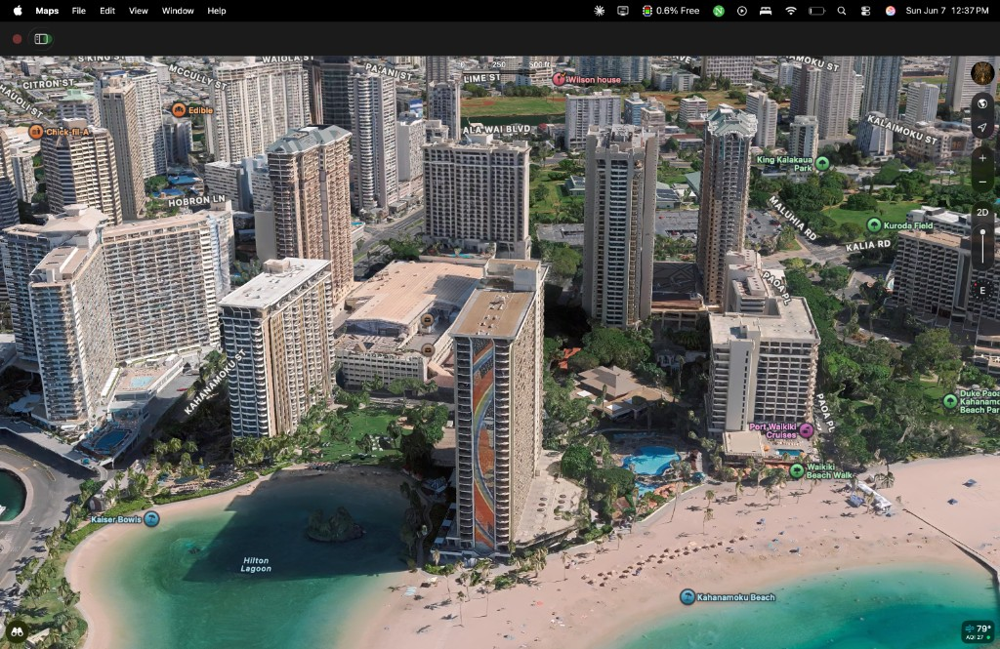

# LinenFlow

iOS app for hotel linen room attendants at **Hilton Hawaiian Village, Waikiki** — count received inventory, calculate bundle distribution across towers, track delivery progress, and save daily logs.



## Requirements

- Xcode 16+ (project targets iOS 17+)
- iPhone or iOS Simulator

## Getting Started

1. Open `LinenFlow.xcodeproj` in Xcode.
2. Select the **HimmerFlow** scheme.
3. Build and run on a simulator or device.

```bash
xcodebuild -project LinenFlow.xcodeproj -scheme HimmerFlow \
  -destination 'platform=iOS Simulator,name=iPhone 17 Pro Max' build
```

## Property Towers

Seeded for Hilton Hawaiian Village: Lagoon, GI, GW, Diamond, Alii, Tapa, and Rainbow. Settings includes a property map with tower pins and a link to Apple Maps.


## Local Site Plan

A self-contained, browser-openable Hilton Hawaiian Village site plan lives in `Docs/site-plan/`:

- **`Docs/HiltonHawaiianVillage-SitePlan.svg`** — vector map (north up, GPS-calibrated tower pins)
- **`Docs/site-plan/index.html`** — interactive layers, tower info, zoom, optional satellite background
- **`Docs/site-plan/site-plan-data.json`** — tower GPS, colors, and floor counts (synced with `DefaultData.swift`)

Open locally (no server required):

```bash
open Docs/site-plan/index.html
```

Or serve from the repo root for full fetch support:

```bash
cd Docs && python3 -m http.server 8765
# then open http://localhost:8765/site-plan/
```

Tower data matches the HimmerFlow seed in `LinenFlow/SeedData/DefaultData.swift` and the iOS **Property Overview** map in Settings.

## Project Structure

| Path | Description |
|------|-------------|
| `LinenFlow/` | Main iOS app source |
| `LinenFlowTests/` | Unit tests |
| `LinenFlow Widget/` | Home Screen widget extension |
| `LinenFlowWidgets/` | Widget assets and configuration |
| `android/` | Android companion app |
| `Docs/` | Build log, criteria checklist, property map |

## Tests

Run tests from Xcode (**Product → Test**) or via command line:

```bash
xcodebuild -project LinenFlow.xcodeproj -scheme HimmerFlow \
  -destination 'platform=iOS Simulator,name=iPhone 17 Pro Max' test
```

## CI

GitHub Actions workflows cover iOS build/test, Android build, Swift format lint, and CodeQL analysis. See `.github/workflows/`.

## License

Private — all rights reserved.
